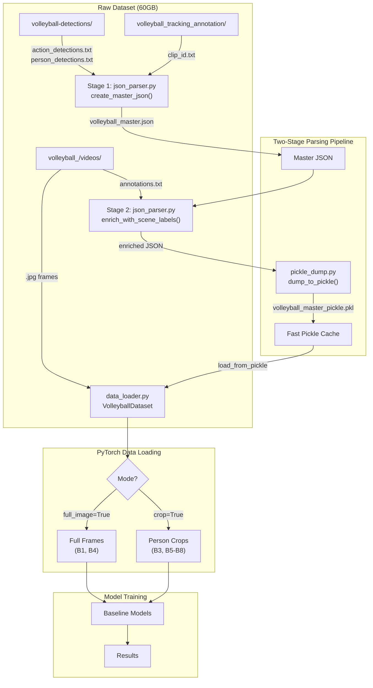
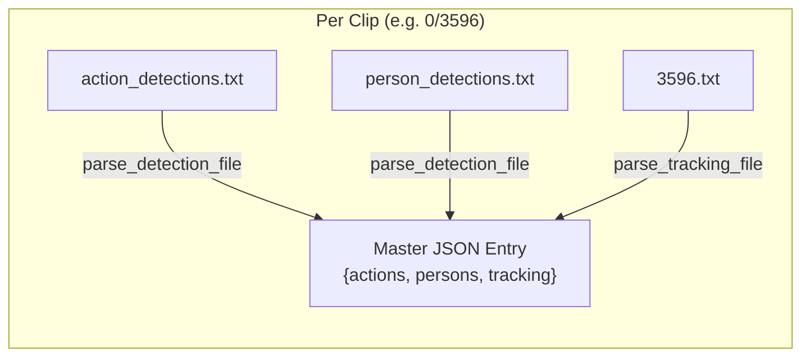
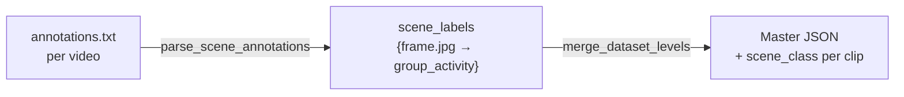
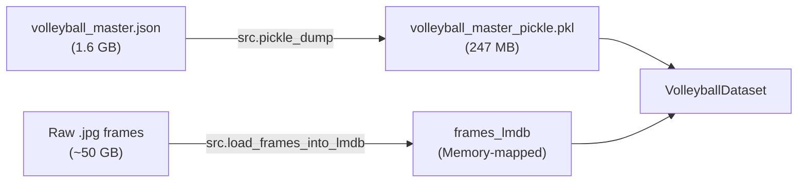
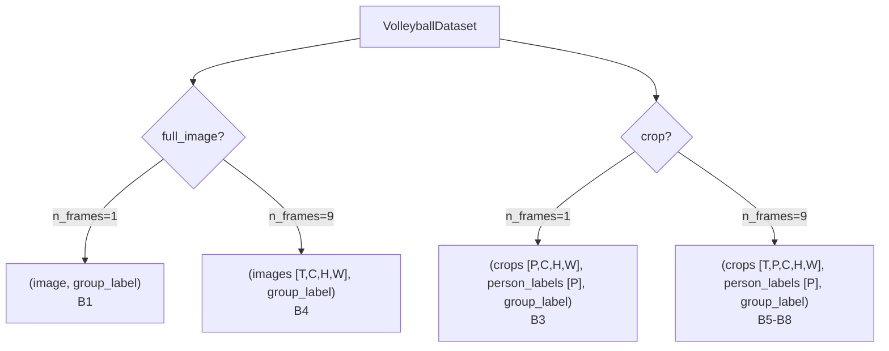
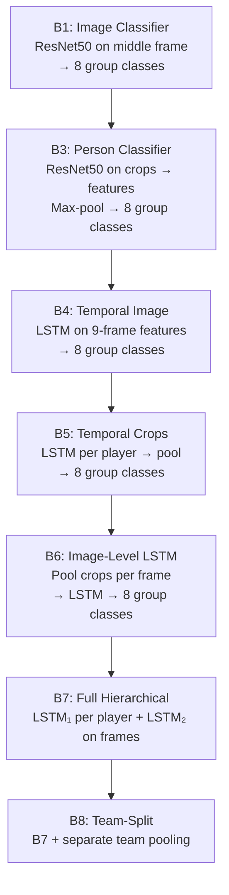

# Volleyball Group Activity Recognition

A deep learning pipeline for **group activity recognition** in volleyball videos, based on the [CVPR 2016 paper](https://www.cs.sfu.ca/~mori/research/papers/ibrahim-cvpr16.pdf) by Mostafa S. Ibrahim et al.

The project implements a hierarchical data pipeline and a generic PyTorch data loader that supports **8 progressively complex baseline models** (B1–B8).

---

## Table of Contents

- [Project Architecture](#project-architecture)
- [Data Pipeline](#data-pipeline)
- [Dataset Structure](#dataset-structure)
- [Annotation Levels](#annotation-levels)
- [Data Loader](#data-loader)
- [Baseline Models](#baseline-models)
- [Project Structure](#project-structure)
- [Setup & Usage](#setup--usage)

---

## Project Architecture



---

## Data Pipeline

The raw dataset contains three separate annotation sources. Our pipeline unifies them in two stages:

### Stage 1 — Player-Level Parsing



`create_master_json()` iterates over all 55 videos × ~90 clips each, parsing:

| Source File | Parser | Output per Frame |
|---|---|---|
| `action_detections.txt` | `parse_detection_file()` | `{box: [x,y,w,h], score, label}` |
| `person_detections.txt` | `parse_detection_file()` | `{box: [x,y,w,h], score, label}` |
| `clip_id.txt` (tracking) | `parse_tracking_file()` | `{id, box: [x1,y1,x2,y2], flags, action}` |

### Stage 2 — Scene-Level Enrichment



`enrich_with_scene_labels()` reads each video's `annotations.txt` to extract the **group-activity label** (one of 8 scene classes) and attaches it to each clip as `"scene_class"`.

### Pickle & LMDB Caching

To avoid severe I/O bottlenecks and RAM exhaustion during training, the dataset is cached in two high-performance formats:

1. **Annotations (Pickle)**: The enriched JSON (~1.6 GB) is dumped to pickle (`volleyball_master_pickle.pkl`, ~247 MB) for instantaneous metadata loading.
2. **Frames (LMDB)**: The raw `.jpg` frames (~50 GB) are packed into a memory-mapped LMDB database (`frames_lmdb`) to allow lightning-fast lazy loading of image bytes on the fly.

Both build scripts are **singletons** — they skip execution if the database already exists.



---

## Dataset Structure

```
DataSet/
├── volleyball_/videos/                    # Raw video frames + annotations
│   ├── 0/                                 # Video 0
│   │   ├── annotations.txt               # Group activity + person boxes per clip
│   │   ├── 3596/                          # Clip (middle frame = 3596)
│   │   │   ├── 3576.jpg                   # 41 frames per clip
│   │   │   ├── 3577.jpg
│   │   │   ├── ...
│   │   │   └── 3616.jpg
│   │   └── 13286/
│   │       └── ...
│   ├── 1/
│   └── ... (55 videos total, ~4830 clips)
│
├── volleyball-detections/                 # Pre-computed detections
│   └── {video_id}/{clip_id}/
│       ├── action_detections.txt          # Tab-separated: frame  N  [x y w h score label] × N
│       └── person_detections.txt          # Tab-separated: frame  N  [x y w h score label] × N
│
├── volleyball_tracking_annotation/        # Player tracking with IDs
│   └── {video_id}/{clip_id}/
│       └── {clip_id}.txt                  # Space-separated: id x1 y1 x2 y2 frame f1 f2 f3 action
│
├── volleyball_master.json                 # Stage 1+2 unified output
└── volleyball_master_pickle.pkl           # Fast-load cache
```

### Data Splits

| Split       | Videos | Clips |
|-------------|--------|-------|
| **Train**      | 24     | 2,152 |
| **Validation** | 15     | 1,341 |
| **Test**       | 16     | 1,337 |
| **Total**      | 55     | 4,830 |

---

## Annotation Levels

### 8 Group Activities (Scene-Level)

| Index | Activity | Index | Activity |
|-------|----------|-------|----------|
| 0 | `l-pass` | 4 | `l_set` |
| 1 | `r-pass` | 5 | `r_set` |
| 2 | `l-spike` | 6 | `l_winpoint` |
| 3 | `r_spike` | 7 | `r_winpoint` |

### 9 Person Actions (Player-Level)

| Index | Action | Index | Action |
|-------|--------|-------|--------|
| 0 | `blocking` | 5 | `setting` |
| 1 | `digging` | 6 | `spiking` |
| 2 | `falling` | 7 | `standing` |
| 3 | `jumping` | 8 | `waiting` |
| 4 | `moving` | | |

---

## Data Loader

`VolleyballDataset` is a **generic** PyTorch `Dataset` that loads from the pickle cache and supports all baselines through constructor flags:

```python
from src.data.data_loader import VolleyballDataset, collate_fn

# B1: Full image, middle frame only → (image, group_label)
ds = VolleyballDataset(mode="train", n_frames=1, full_image=True, transform=transform)

# B3: Cropped persons, middle frame → (crops [P,C,H,W], person_labels [P], group_label)
ds = VolleyballDataset(mode="train", n_frames=1, crop=True, transform=transform)

# B4: Full image, 9-frame sequence → (images [9,C,H,W], group_label)
ds = VolleyballDataset(mode="train", n_frames=9, full_image=True, transform=transform)

# B5-B8: Cropped persons, 9-frame sequence → (crops [9,P,C,H,W], person_labels [P], group_label)
ds = VolleyballDataset(mode="train", n_frames=9, crop=True, transform=transform)
```

### Return Shapes by Configuration



### Collate Function

`collate_fn` handles **variable player counts** across clips by padding the player dimension to the batch maximum and returning a boolean mask:

```python
loader = DataLoader(dataset, batch_size=8, collate_fn=collate_fn)
# Crop mode returns: (crops_batch, person_labels_batch, group_labels_batch, masks_batch)
```

---

## Baseline Models



| Baseline | Input | Temporal | Player-Level | Scene-Level |
|----------|-------|----------|--------------|-------------|
| **B1** | Middle frame (full) | ✗ | ✗ | Image classifier (8 classes) |
| **B3** | Middle frame (crops) | ✗ | Crop classifier (9 classes) | Max-pool features → NN (8 classes) |
| **B4** | 9 frames (full) | LSTM on frame features | ✗ | LSTM → 8 classes |
| **B5** | 9 frames (crops) | LSTM per player | Max-pool players | NN (8 classes) |
| **B6** | 9 frames (crops) | LSTM on pooled frames | Max-pool per frame | LSTM → 8 classes |
| **B7** | 9 frames (crops) | LSTM₁ per player + LSTM₂ | Max-pool per frame | LSTM₂ → 8 classes |
| **B8** | 9 frames (crops) | LSTM₁ per player + LSTM₂ | Team-split pool (6+6) | Concat teams → LSTM₂ |

---

## Project Structure

```
Project1/
├── configs/
│   ├── __init__.py              # Package exports
│   ├── path_config.py           # All dataset/output paths
│   ├── data_split.py            # Train/val/test video IDs
│   ├── labels.py                # Label-to-index mappings (8 group + 9 person)
│   ├── baseline1.yaml           # Hydra config for B1
│   ├── baseline3.yaml           # Hydra config for B3
│   └── transforms/
│       └── default_transforms.yaml
│
├── src/
│   ├── json_parser.py           # Two-stage parsing pipeline
│   ├── pickle_dump.py           # Singleton pickle dump/load
│   └── data/
│       ├── data_loader.py       # Generic VolleyballDataset + collate_fn
│       ├── data_summary.py      # Statistics and class distributions
│       └── visualize_data.py    # Dataset visualization
│
├── models/
│   ├── baseline1.py             # B1: Fine-tuned ResNet50 classifier
│   └── baseline3.py             # B3: Sequence ResNet with crop pooling
│
├── utils/
│   └── utility.py               # Training/eval helpers
│
├── reports/
│   ├── report.tex               # LaTeX report
│   └── figures/                 # Distribution plots
│
├── DataSet/                     # Raw data (not tracked in git)
├── saved_models/                # Model checkpoints
├── runs/                        # TensorBoard logs
└── plots/                       # Output visualizations
```

---

## Setup & Usage

### 1. Install Dependencies

```bash
pip install -r requirements.txt
```

### 2. Prepare the Dataset (one-time)

Execute the following commands in order to build the caching databases:

```bash
# Step 1: Build master JSON from detections + tracking and enrich with scene labels
python -m src.json_parser

# Step 2: Dump annotations to pickle for fast loading
python -m src.pickle_dump

# Step 3: Pack raw frames into a high-performance memory-mapped LMDB database
python -m src.load_frames_into_lmdb
```

### 3. Verify the Loader

```bash
python -m src.data.data_loader
```

### 4. Train a Baseline

```bash
python models/baseline1.py   # B1: Image classifier
python models/baseline3.py   # B3: Crop-based classifier
```

---

## Video Sample

[output video](output.mp4)
