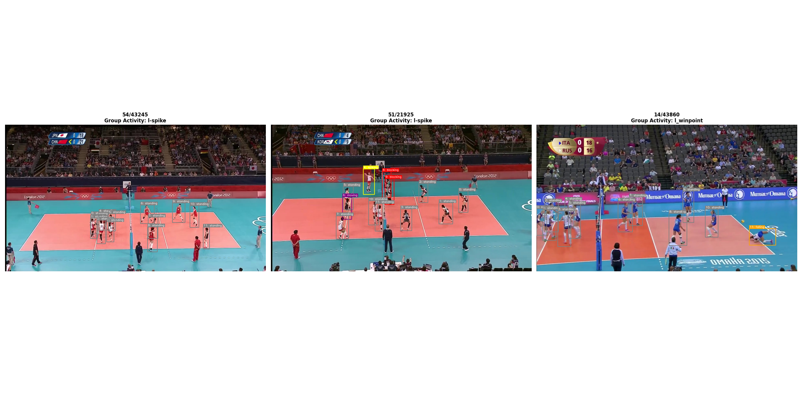
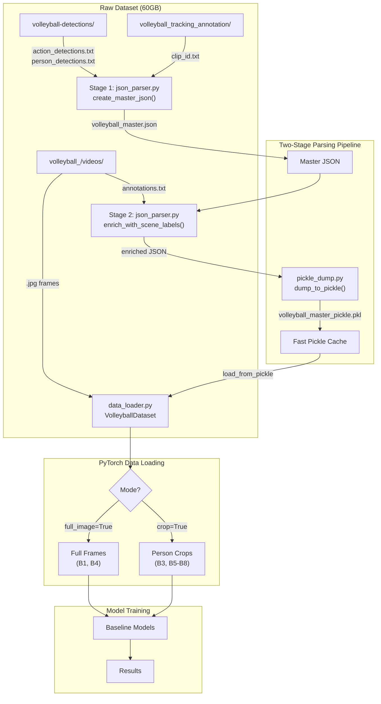
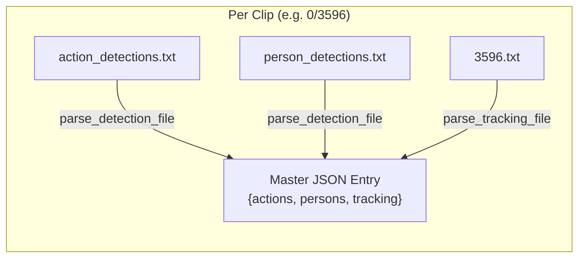
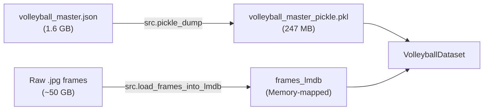
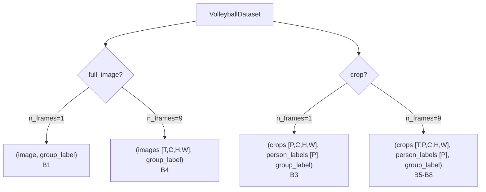

# Volleyball Group Activity Recognition

A deep learning pipeline for **group activity recognition** in volleyball videos, based on the [CVPR 2016 paper](https://www.cs.sfu.ca/~mori/research/papers/ibrahim-cvpr16.pdf) by Mostafa S. Ibrahim et al.



The snapshot shows the output of `python -m src.data.visualize_data` with `video_fully_annotated=True`.

---

## At a Glance

- **Dataset**: 55 volleyball videos, 4,830 clips, two annotation levels — 8 group activities (scene-level) and 9 person actions (player-level).
- **Baselines**: 8 progressively complex models (B1–B8) sharing a single data loader. **B1, B3, B4, B5, and B6 are complete; B7 and B8 are pending.**
- **Stack**: PyTorch + Hydra config + TensorBoard logging; multi-GPU via `nn.DataParallel`; Kaggle dual-T4 ready.
- **Paper**: Ibrahim et al., *A Hierarchical Deep Temporal Model for Group Activity Recognition*, CVPR 2016.

### Results Summary

| Baseline | Idea | Test Acc | Macro F1 | Test Loss |
|----------|------|---------:|---------:|----------:|
| B1 | Single middle frame → fine-tuned ResNet-50 | 62.60% | 0.630 | 1.42 |
| B3 | Person crops → frozen backbone → concat-pool → MLP | 60.73% | 0.589 | 1.09 |
| B4 | 9 frames → frozen B1 backbone → LSTM | 66.12% | 0.673 | 1.05 |
| B5 | Per-player LSTM → pool summaries → MLP | 66.34% | 0.619 | **0.97** |
| **B6** | **Pool players per frame → scene LSTM + skip Conv1d** | **70.53%** | **0.686** | 1.04 |
| B7 | Hierarchical: player LSTM₁ → pool per frame → scene LSTM₂ | *pending* | | |
| B8 | B7 + team-split pooling (6+6, concat) | *pending* | | |

Per-baseline architecture, hyperparameters, and analysis: [Baselines & Results](#baselines--results).

---

## Table of Contents

- [Quick Start](#quick-start)
- [Baselines & Results](#baselines--results)
- [Dataset](#dataset)
- [Data Pipeline](#data-pipeline)
- [Data Loader API](#data-loader-api)
- [Project Structure](#project-structure)
- [References](#references)

---

## Quick Start

### 1. Install Dependencies

```bash
pip install -r requirements.txt
```

### 2. Prepare the Dataset (one-time)

```bash
# Step 1: build master JSON from detections + tracking and enrich with scene labels
python -m src.json_parser

# Step 2: dump annotations to a pickle cache for fast metadata loading
python -m src.pickle_dump

# Step 3: pack raw .jpg frames into a memory-mapped LMDB database
python -m src.load_frames_into_lmdb
```

All three scripts are singletons — they skip work if the output already exists.

### 3. Verify the Loader

```bash
python -m src.data.data_loader          # LMDB backend (local)
python -m src.data.kaggle_data_loader   # disk backend (Kaggle / no LMDB)
```

Smoke-tests the dataset by pulling a few batches in full-image and crop mode. After (re)building the JSON/pickle, also verify that each clip's `scene_class` matches its own video's `annotations.txt` before training.

### 4. Train a Baseline

```bash
python -m models.baseline1   # B1: Two-stage fine-tuned ResNet-50
python -m models.baseline3   # B3: Person-then-group crop classifier
python -m models.baseline4   # B4: Frozen B1 backbone → LSTM (needs baseline1_run2.pt)
python -m models.baseline5   # B5: Per-player LSTM → pooled group head (needs baseline3_stage_a_run2.pt)
python -m models.baseline6   # B6: Pooled-scene LSTM + skip Conv1d (needs baseline3_stage_a_run2.pt)
```

(With `uv`, prefix commands with `uv run`, e.g. `uv run python -m models.baseline1`.)

Hyperparameters live in `configs/baseline{1,3,4,5,6}.yaml` (Hydra). Per-epoch metrics are written to `logs/<baseline>/runN.json` and a TensorBoard event file under `logs/<baseline>/tensorboard/runN/`.

### 5. Evaluate a Trained Checkpoint

```bash
uv run python -m utils.evaluate --model baseline1_run1.pt           --baseline baseline1
uv run python -m utils.evaluate --model baseline3_stage_b_run2.pt   --baseline baseline3
uv run python -m utils.evaluate --model baseline4_run2.pt           --baseline baseline4
uv run python -m utils.evaluate --model baseline5_stage_b_run4.pt   --baseline baseline5 --batch-size 4
uv run python -m utils.evaluate --model baseline6_stage_b_run2.pt   --baseline baseline6 --batch-size 4
```

Produces confusion matrix, classification report, precision–recall curves, and mAP under `plots/<baseline>/`. `--device cpu` forces CPU; `--batch-size` overrides the config's batch (B5/B6 clips are 9×~12 crops each, so batch 4 is the 8 GB-GPU sweet spot). The evaluator **auto-detects saved architecture details** (pool mode, LSTM shape, head width, frame count) from the checkpoint's tensor shapes, so legacy checkpoints and post-training YAML edits both load without changes.

---

## Baselines & Results

The ladder is a designed ablation — each rung isolates one component (person crops, player-level time, scene-level time, team structure):

| Baseline | Status | Input | Temporal | Player-Level | Scene-Level |
|----------|--------|-------|----------|--------------|-------------|
| **B1** | ✅ Done | Middle frame (full) | ✗ | ✗ | Image classifier (8 classes) |
| **B3** | ✅ Done | Middle frame (crops) | ✗ | Crop classifier (9 classes) | Max+mean concat pool over players → MLP (8 classes) |
| **B4** | ✅ Done | 9 frames (full) | LSTM on frame features | ✗ | LSTM → 8 classes |
| **B5** | ✅ Done | 9 frames (crops) | LSTM per player | Max+mean concat pool over players | MLP (8 classes) |
| **B6** | ✅ Done | 9 frames (crops) | LSTM on pooled frames + skip Conv1d fusion | Max-pool per frame (frozen B3 features) | Conv1d summary → MLP (8 classes) |
| **B7** | 🔲 Pending | 9 frames (crops) | LSTM₁ per player + LSTM₂ | Max-pool per frame | LSTM₂ → 8 classes |
| **B8** | 🔲 Pending | 9 frames (crops) | LSTM₁ per player + LSTM₂ | Team-split pool (6+6) | Concat teams → LSTM₂ |

Each completed baseline below follows the same template: **architecture → test metrics → analysis**, with hyperparameters and evaluation plots collapsed.

### Baseline 1 — Single-Frame Image Classifier

Fine-tunes a ResNet-50 on the middle frame of each clip to predict the 8 group activities. Training uses a two-stage strategy: a linear probe (head-only) followed by partial fine-tuning (layer3/4 + head) with differential learning rates and cosine annealing.

<details>
<summary><b>Hyperparameters</b> (<code>configs/baseline1.yaml</code>)</summary>

| Hyperparameter | Value |
|---|---|
| Backbone | ResNet-50 (pretrained) |
| Stage 1 (linear probe) | 10 epochs, lr = 1e-3 |
| Stage 2 (partial fine-tune: layer3/4 + head) | up to 100 epochs, backbone lr = 2.5e-4, head lr = 7.5e-4 |
| Batch Size | 16 (matched to B3 for comparability; LR linearly rescaled) |
| LR Scheduler | CosineAnnealingLR (T_max = 100, eta_min = 1e-5) |
| Label Smoothing | 0.01 |
| Weight Decay | 1e-4 |
| Early Stopping Patience | 25 epochs |

</details>

#### Test Metrics

| Metric | Value |
|--------|-------|
| Accuracy | **62.60%** |
| Macro F1 | **0.630** |
| Loss | 1.42 |

A single frame with no person or temporal structure sets the floor for the ladder.

<details>
<summary><b>Evaluation plots</b></summary>

| Confusion Matrix | Classification Report |
|:---:|:---:|
|  |  |
| **Precision-Recall Curves** | **mAP & F1 per Class** |
|  |  |

</details>

### Baseline 3 — Person Crops → Frozen Backbone → Concat-Pool → MLP

A two-stage architecture. **Stage A** trains a ResNet-50 end-to-end on individual player crops to classify the 9 person actions (`blocking`, `digging`, …, `waiting`). **Stage B** freezes that backbone (with `fc = Identity`), passes the per-player crops of a clip through it to produce one `(P, 2048)` feature matrix per clip, applies concatenated max- and mean-pool across the player dimension to get a `(2 × 2048)`-wide vector, and trains a small MLP head to predict the 8 group activities.

The concat pool gives the head two complementary signals: max captures *"is any player exhibiting feature k strongly?"* and mean captures *"what's the typical team level of feature k?"*. Class-weighted CrossEntropy is used in both stages to counter the heavy `standing` skew in Stage A (~70% of all crops) and the rare `l/r_winpoint` classes (~2.5× rarer than `spike/pass/set`) in Stage B.

<details>
<summary><b>Hyperparameters</b> (<code>configs/baseline3.yaml</code>)</summary>

| Hyperparameter | Value |
|---|---|
| Backbone | ResNet-50 (pretrained) — `cfg.model.name` switchable to `resnet101` |
| Stage A (person-action) | up to 50 epochs, lr = 1e-3, full backbone, class-weighted CE |
| Stage B (group-activity head) | up to 50 epochs, lr = 1e-3, frozen backbone, MLP head |
| Stage B pool | `concat` (max + mean), classifier in = 2 × 2048 |
| MLP head | `Linear(4096, 512) → ReLU → Dropout(0.4) → Linear(512, 8)` |
| Optimizer | SGD, momentum 0.9, Nesterov, weight decay 5e-4 |
| LR Scheduler (Stage B) | CosineAnnealingLR |
| Label Smoothing | 0.01 |
| Batch Size | 16 clips (~12 player crops each) |
| Transforms | `crop_transforms.yaml` — direct 224×224 warp, whole player visible |
| Class-weighted loss | inverse-frequency (`w_k = N / (K · n_k)`), both stages |
| Multi-GPU | `nn.DataParallel` when `n_gpus > 1` (Kaggle dual-T4 ready) |
| Early Stopping Patience | 10 epochs per stage |

</details>

#### Test Metrics

| Metric | Value |
|--------|-------|
| Accuracy | **60.73%** |
| Macro F1 | **0.589** |
| Loss | 1.09 |

Stage A reaches 70.4% best validation accuracy (macro F1 0.512) on the 9 person actions; Stage B reaches 60.0% (0.584) on the 8 group activities.

**Known limitation:** the model overfits — final train accuracy is ~95% in both stages against ~58–70% validation. To be addressed with stronger augmentation / dropout / earlier stopping.

<details>
<summary><b>Evaluation plots</b></summary>

| Confusion Matrix | Classification Report |
|:---:|:---:|
|  |  |
| **Precision-Recall Curves** | **mAP & F1 per Class** |
|  |  |

</details>

### Baseline 4 — Temporal Image Classifier (Frozen B1 Backbone → LSTM)

Each clip's 9-frame window is pushed through a **frozen** feature extractor loaded from Baseline 1's fine-tuned backbone (`utils/featureExtractor.py`), producing a `(9, 2048)` feature sequence per clip. A single-layer LSTM consumes the sequence and its final hidden state is classified into the 8 group activities by a small MLP head. Only the LSTM + head train (~5.4M parameters).

<details>
<summary><b>Hyperparameters</b> (<code>configs/baseline4.yaml</code>)</summary>

| Hyperparameter | Value |
|---|---|
| Feature extractor | ResNet-50, frozen, loaded from `baseline1_run2.pt` |
| Input | 9 full frames per clip, 224×224 warp (`default_transforms.yaml`) |
| LSTM | hidden 512, 1 layer |
| MLP head | `Linear(512, 256) → ReLU → Dropout(0.3) → Linear(256, 8)` |
| Optimizer | SGD lr = 1e-3, momentum 0.9, Nesterov, weight decay 5e-4 |
| LR Scheduler | CosineAnnealingLR |
| Batch Size | 16 clips (144 frames/step through the frozen backbone) |
| Class-weighted loss | inverse-frequency, label smoothing 0.01 |
| Early Stopping | patience 10 (stopped at epoch 14; best epoch 4) |

</details>

#### Test Metrics

| Metric | Value |
|--------|-------|
| Accuracy | **66.12%** |
| Macro F1 | **0.673** |
| Loss | 1.05 |

Adding temporal context over B1's own features is worth **+3.5 accuracy points / +0.043 macro-F1** versus B1's single-frame result — the first direct evidence in this project that motion carries group-activity signal.

**Known limitation:** convergence is extremely fast (best validation F1 at epoch 4, train accuracy ~99% by epoch 14) — the same overfitting pattern as B1/B3, and the strongest argument yet for a shared regularization pass.

<details>
<summary><b>Evaluation plots</b></summary>

| Confusion Matrix | Classification Report |
|:---:|:---:|
|  |  |
| **Precision-Recall Curves** | **mAP & F1 per Class** |
|  |  |

</details>

### Baseline 5 — Temporal Person-Level Model (Per-Player LSTM → Pool → MLP)

A two-stage temporal extension of B3. **Stage A** feeds each player's 9-crop sequence through B3's **frozen** Stage-A person-action backbone and trains a shared LSTM + head to classify the 9 person actions from the sequence's final hidden state. **Stage B** freezes the Stage-A model entirely, computes one LSTM summary per player per clip, pools the summaries across the player dimension with masked concat (max ‖ mean), and trains a small MLP to predict the 8 group activities. Padded player slots are excluded from both the loss and the pooling via the collate mask.

<details>
<summary><b>Hyperparameters</b> (<code>configs/baseline5.yaml</code>)</summary>

| Hyperparameter | Value |
|---|---|
| Feature extractor | ResNet-50, frozen, loaded from `baseline3_stage_a_run2.pt` |
| Input | 9-frame crop window per player (`crop_transforms.yaml`, 224×224 warp) |
| Shared player LSTM | hidden 3072, 1 layer |
| Stage B pool | `concat` (max ‖ mean) → classifier in = 2 × 3072 |
| MLP head | `Linear(6144, 3072) → LayerNorm → ReLU → Dropout(0.2) → Linear(3072, 1536) → LayerNorm → ReLU → Dropout(0.2) → Linear(1536, 8)` |
| Optimizer | SGD lr = 1e-3, momentum 0.9, Nesterov, weight decay 5e-4 |
| LR Scheduler (Stage B) | CosineAnnealingLR |
| Batch | effective 8 = micro 4 × 2 gradient-accumulation steps |
| Class-weighted loss | inverse-frequency, both stages; label smoothing 0.01 |
| Early Stopping | patience 10 (Stage A: 25 epochs, best 15; Stage B: 34 epochs) |

</details>

#### Test Metrics (run 4)

| Metric | Value |
|--------|-------|
| Accuracy | **66.34%** |
| Macro F1 | **0.619** |
| Loss | 0.97 |

**Analysis.** B5 posts the best test accuracy of baselines B1–B5 (66.3% vs B4's 66.1%, B1's 62.6%, B3's 60.7%) and the best test loss of the project (0.97), and it dominates on the core activities: spike F1 reaches **0.78–0.80** and set **0.71** on both sides — per-player temporal modeling clearly pays off over B3's single-frame crops and B4's scene-level features. Cross-activity confusion is nearly eliminated (a spike is almost never called a pass or set).

The macro-F1 (0.619) nevertheless trails B4 (0.673), and the cause is a single failure mode: **`l_winpoint` / `r_winpoint` confusion — the worst left/right confusion of any baseline in this project**. `r_winpoint` collapses to 0.08 recall / 0.13 F1, with **83% of true `r_winpoint` clips predicted as `l_winpoint`** (and a further 13% of `l_winpoint` leaking the other way). The explanation is structural: max/mean pooling across all ~12 players is orderless and position-blind, so the pooled vector carries no signal about *which side of the net* the players are on. Pass/spike/set survive because the acting players' poses differ, but winpoint clips show both teams in near-identical celebration/standing poses — side identity is the *only* discriminative signal, and the pooling erases it. This is precisely the failure B8's team-split pooling (pool each team's 6 players separately, concatenate) is designed to fix.

<details>
<summary><b>Evaluation plots</b></summary>

| Confusion Matrix | Classification Report |
|:---:|:---:|
|  |  |
| **Precision-Recall Curves** | **mAP & F1 per Class** |
|  |  |

</details>

### Baseline 6 — Scene-Level Temporal Model (Pool per Frame → LSTM → Skip Conv1d Fusion)

B6 moves the temporal model from the player level (B5) to the **scene level**: each frame's player crops go through B3's **frozen** Stage-A backbone and are **masked max-pooled across players per frame**, producing a `(9, 2048)` scene sequence per clip. An LSTM consumes it, and — instead of using only the last hidden state — its 9 hidden states are concatenated **along the time axis** with a linear projection of the pooled per-frame features (skip connection), giving `(18, 512)`. A two-stage Conv1d with a global temporal kernel collapses this into a 128-dim clip summary.

**Stage A** pretrains the LSTM + projection + Conv1d on the 9 person actions using single-player tracks (P=1, so the per-frame pooling is an identity). **Stage B** is two-phase, mirroring B1: a **linear probe** (temporal model frozen, MLP head only), then a **joint fine-tune** that unfreezes the LSTM/projection/Conv1d with differential learning rates. The ResNet extractor stays frozen throughout.

<details>
<summary><b>Hyperparameters</b> (<code>configs/baseline6.yaml</code>)</summary>

| Hyperparameter | Value |
|---|---|
| Feature extractor | ResNet-50, frozen, loaded from `baseline3_stage_a_run2.pt` |
| Input | 9-frame crop window per player (`crop_transforms.yaml`, 224×224 warp) |
| Player pool (per frame, pre-LSTM) | masked **max** over players → `(9, 2048)` scene sequence |
| Scene LSTM | hidden 512, 1 layer |
| Skip connection | pooled features → `Linear(2048, 512)`, concat with LSTM outputs along time → `(18, 512)` |
| Temporal fusion | `Conv1d(512→256, k=18) → BN → ReLU → Conv1d(256→128, k=1) → BN` → 128-dim summary |
| MLP head | `Linear(128, 512) → LayerNorm → ReLU → Dropout(0.2) → Linear(512, 256) → LayerNorm → ReLU → Dropout(0.2) → Linear(256, 8)` |
| Stage A | 9-action pretrain on P=1 tracks; SGD lr = 1e-3; 28 epochs (early stop, best at 13; val action F1 0.539) |
| Stage B phase 1 | linear probe, head only, lr = 1e-3 flat, 10 epochs |
| Stage B phase 2 | joint fine-tune: temporal lr = 1e-4, head lr = 1e-3 (×10), CosineAnnealingLR, 50 epochs |
| Batch | effective 8 = micro 4 × 2 gradient-accumulation steps |
| Class-weighted loss | inverse-frequency, both stages; label smoothing 0.01 |

</details>

#### Test Metrics (run 2)

| Metric | Value |
|--------|-------|
| Accuracy | **70.53%** |
| Macro F1 | **0.686** |
| Loss | 1.04 |

**Analysis.** B6 is the **first baseline to lead on both metrics**: accuracy jumps **+4.2 points over B5** (70.5% vs 66.3%) and macro-F1 edges past B4's long-standing best (0.686 vs 0.673). Scene-level temporal modeling over pooled person features — the paper's "two-stage model without LSTM 1", which scores 74.7% there — clearly beats both scene-level features without persons (B4) and per-player summaries without scene dynamics (B5), and the remaining ~4-point gap to the paper's number is consistent with our frozen (rather than end-to-end) backbone.

The two-phase Stage B was decisive, and the phase curves prove why: the **linear probe plateaued at 0.426 val F1** — a frozen LSTM pretrained only on person actions is a poor group-activity descriptor (the same lesson as the discarded run 1, which froze everything and stalled at 0.33) — while **joint fine-tuning lifted val F1 to 0.646 (+0.22)**. The scene LSTM has to see the group labels; the probe merely gives the head a stable starting point before the temporal weights move.

Per-class, B6 is strong on the acting-player activities — spike F1 hits **0.86/0.82** (l/r) and set 0.72/0.69 — and it **halves B5's winpoint collapse without any team-aware pooling**: `r_winpoint` recall recovers from 0.08 to **0.47** (F1 0.13 → 0.49) and `l_winpoint` reaches F1 0.55. Scene-level temporal context evidently carries some side signal that per-player last-hidden summaries lost. Still, **left/right confusion is now the dominant remaining error across the board**: 47% of true `r_winpoint` goes to `l_winpoint`, l/r-pass leak 20–22% into each other, and 21% of `l_set` is called `r_set` — the model is often right about *what* happened but guesses *which side*. All-player max pooling remains side-blind; that is exactly B8's team-split target. Overfitting is the other standing issue (Stage A train F1 0.96 vs val 0.54; fine-tune train 0.93 vs val 0.64).

<details>
<summary><b>Evaluation plots</b></summary>

| Confusion Matrix | Classification Report |
|:---:|:---:|
|  |  |
| **Precision-Recall Curves** | **mAP & F1 per Class** |
|  |  |

</details>

---

## Dataset

### Class Labels

**8 Group Activities (scene-level)**

| Index | Activity | Index | Activity |
|-------|----------|-------|----------|
| 0 | `l-pass` | 4 | `l_set` |
| 1 | `r-pass` | 5 | `r_set` |
| 2 | `l-spike` | 6 | `l_winpoint` |
| 3 | `r_spike` | 7 | `r_winpoint` |

**9 Person Actions (player-level)**

| Index | Action | Index | Action |
|-------|--------|-------|--------|
| 0 | `blocking` | 5 | `setting` |
| 1 | `digging` | 6 | `spiking` |
| 2 | `falling` | 7 | `standing` |
| 3 | `jumping` | 8 | `waiting` |
| 4 | `moving` | | |

### Splits

| Split | Videos | Clips |
|-------|--------|-------|
| **Train** | 24 | 2,152 |
| **Validation** | 15 | 1,341 |
| **Test** | 16 | 1,337 |
| **Total** | 55 | 4,830 |

Split definitions live in `configs/data_split.py`.

### Raw Directory Layout

```
DataSet/
├── volleyball_/videos/                    # Raw video frames + annotations
│   ├── 0/                                 # Video 0
│   │   ├── annotations.txt                # Group activity + person boxes per clip
│   │   ├── 3596/                          # Clip (middle frame = 3596)
│   │   │   ├── 3576.jpg                   # 41 frames per clip
│   │   │   ├── 3577.jpg
│   │   │   ├── ...
│   │   │   └── 3616.jpg
│   │   └── 13286/
│   │       └── ...
│   ├── 1/
│   └── ... (55 videos total, ~4,830 clips)
│
├── volleyball-detections/                 # Pre-computed detections
│   └── {video_id}/{clip_id}/
│       ├── action_detections.txt          # Tab-separated: frame  N  [x y w h score label] × N
│       └── person_detections.txt          # Tab-separated: frame  N  [x y w h score label] × N
│
├── volleyball_tracking_annotation/        # Player tracking with IDs
│   └── {video_id}/{clip_id}/
│       └── {clip_id}.txt                  # Space-separated: id x1 y1 x2 y2 frame f1 f2 f3 action
│
├── volleyball_master.json                 # Stage 1+2 unified output
└── volleyball_master_pickle.pkl           # Fast-load cache
```

---

## Data Pipeline

The raw dataset contains three separate annotation sources. The pipeline unifies them in two parsing stages, then caches in two fast-loading formats. End-to-end flow:



### Stage 1 — Player-Level Parsing



`create_master_json()` iterates over all 55 videos × ~90 clips each, parsing:

| Source File | Parser | Output per Frame |
|---|---|---|
| `action_detections.txt` | `parse_detection_file()` | `{box: [x,y,w,h], score, label}` |
| `person_detections.txt` | `parse_detection_file()` | `{box: [x,y,w,h], score, label}` |
| `clip_id.txt` (tracking) | `parse_tracking_file()` | `{id, box: [x1,y1,x2,y2], flags, action}` |

### Stage 2 — Scene-Level Enrichment


`enrich_with_scene_labels()` reads each video's `annotations.txt` to extract the **group-activity label** (one of 8 scene classes) and attaches it to each clip as `"scene_class"`. The lookup is **keyed per video** and matches each clip's own middle frame (`<clip_id>.jpg`), since frame names are only unique *within* a video.

### Pickle & LMDB Caching

To avoid severe I/O bottlenecks and RAM exhaustion during training, the dataset is cached in two high-performance formats:

1. **Annotations (Pickle)**: The enriched JSON (~1.6 GB) is dumped to pickle (`volleyball_master_pickle.pkl`, ~247 MB) for instantaneous metadata loading.
2. **Frames (LMDB)**: The raw `.jpg` frames (~50 GB) are packed into a memory-mapped LMDB database (`frames_lmdb`) to allow lightning-fast lazy loading of image bytes on the fly.

Both build scripts are **singletons** — they skip execution if the database already exists.



---

## Data Loader API

`VolleyballDataset` is a **generic** PyTorch `Dataset` that loads from the pickle cache and supports all baselines through constructor flags. All logic lives in a shared base class (`src/data/base_dataset.py`); two thin backends provide the frame storage:

| Import from | Frame storage | Use when |
|---|---|---|
| `src.data.data_loader` | LMDB (memory-mapped) | local training, LMDB built |
| `src.data.kaggle_data_loader` | direct disk reads | Kaggle (no space for LMDB) |

Both expose the identical `VolleyballDataset` / `collate_fn` interface — switching is a one-line import change.

```python
from src.data.data_loader import VolleyballDataset, collate_fn

# B1: Full image, middle frame only → (image, group_label)
ds = VolleyballDataset(mode="train", n_frames=1, full_image=True, transform=transform)

# B3: Cropped persons, middle frame → (crops [P,C,H,W], person_labels [P], group_label)
ds = VolleyballDataset(mode="train", n_frames=1, crop=True, transform=transform)

# B4: Full image, 9-frame sequence → (images [9,C,H,W], group_label)
ds = VolleyballDataset(mode="train", n_frames=9, full_image=True, transform=transform)

# B5-B8: Cropped persons, 9-frame sequence → (crops [9,P,C,H,W], person_labels [P], group_label)
ds = VolleyballDataset(mode="train", n_frames=9, crop=True, transform=transform)
```

### Return Shapes by Configuration



### Collate Function

`collate_fn` handles **variable player counts** across clips by padding the player dimension to the batch maximum and returning a boolean mask:

```python
loader = DataLoader(dataset, batch_size=8, collate_fn=collate_fn)
# Crop mode returns: (crops_batch, person_labels_batch, group_labels_batch, masks_batch)
```

### Per-Baseline Batch Unpackers

Each baseline that uses crop mode pairs the loader with a tiny `batch_unpack` callable that surfaces the right `(model_inputs, target)` from the 4-tuple. These slot into the shared training/eval driver in `utils.utility` (see `train_one_epoch`'s `batch_unpack` kwarg) and into `utils.evaluate`. Adding a new baseline = one model class + one unpacker; no changes to the loader or the training loop.

---

## Project Structure

```
Project1/
├── configs/
│   ├── __init__.py              # Package exports
│   ├── path_config.py           # All dataset/output paths (local + Kaggle aware)
│   ├── data_split.py            # Train/val/test video IDs
│   ├── labels.py                # Label-to-index mappings (8 group + 9 person)
│   ├── baseline1.yaml           # Hydra config for B1
│   ├── baseline3.yaml           # Hydra config for B3
│   ├── baseline4.yaml           # Hydra config for B4
│   ├── baseline5.yaml           # Hydra config for B5
│   ├── baseline6.yaml           # Hydra config for B6
│   └── transforms/
│       ├── default_transforms.yaml  # FULL-FRAME baselines (B1, B4): 224×224 warp
│       └── crop_transforms.yaml     # CROP baselines (B3, B5–B8): 224×224 warp
│
├── src/
│   ├── json_parser.py           # Two-stage parsing pipeline
│   ├── pickle_dump.py           # Singleton pickle dump/load
│   ├── load_frames_into_lmdb.py # Pack frames into LMDB
│   ├── load_frames_into_pickle.py
│   └── data/
│       ├── base_dataset.py      # Shared dataset logic + collate_fn (storage-agnostic)
│       ├── data_loader.py       # LMDB backend
│       ├── kaggle_data_loader.py# Direct-from-disk backend (Kaggle)
│       ├── data_summary.py      # Statistics and class distributions
│       └── visualize_data.py    # Dataset visualization
│
├── models/
│   ├── baseline1.py             # B1: Two-stage fine-tuned ResNet50 (✅ done)
│   ├── baseline3.py             # B3: Person-then-group crop classifier (✅ done)
│   ├── baseline4.py             # B4: Frozen backbone → LSTM temporal classifier (✅ done)
│   ├── baseline5.py             # B5: Per-player LSTM → pooled group head (✅ done)
│   ├── baseline6.py             # B6: Pooled-scene LSTM + skip Conv1d (✅ done)
│   ├── baseline7.py             # B7: hierarchical two-LSTM model (🔲 stub)
│   └── baseline8.py             # B8: B7 + team-split pooling (🔲 stub)
│
├── utils/
│   ├── utility.py               # Training/eval loop helpers + class-weight tools
│   ├── featureExtractor.py      # Frozen CNN feature extractor (ImageNet or B1 checkpoint)
│   ├── evaluate.py              # Post-training evaluation + plots
│   ├── plotting.py              # Confusion matrix, PR curves, mAP
│   ├── download_models.py       # Pull trained checkpoints from Google Drive
│   └── load_model_config.py     # Hydra config → transforms/scheduler builders
│
├── reports/
│   ├── report.tex               # LaTeX report
│   └── figures/                 # Report figures (incl. demo thumbnail)
│
├── DataSet/                     # Raw data (not tracked in git)
├── saved_models/                # Model checkpoints (.pt)
├── runs/                        # Hydra run outputs
├── logs/                        # Per-baseline TensorBoard + JSON metric logs
└── plots/                       # Evaluation visualizations
    └── baseline{1,3,4,5,6}/     # Four plots per baseline: Confusion Matrix,
                                 # Classification Report, PR Curves, mAP & F1
```

---

## References

- Ibrahim, M. S., Muralidharan, S., Deng, Z., Vahdat, A., & Mori, G. (2016). *A Hierarchical Deep Temporal Model for Group Activity Recognition*. **CVPR 2016**. [PDF](https://www.cs.sfu.ca/~mori/research/papers/ibrahim-cvpr16.pdf).
- Journal extension with group-style (team-split) pooling: [arXiv:1607.02643](https://arxiv.org/abs/1607.02643) — source of the B1–B8 baseline ablation and the accuracy numbers cited above.
