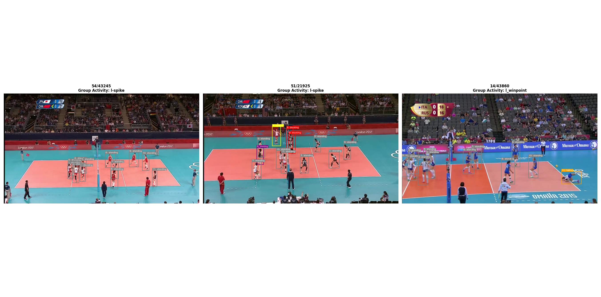
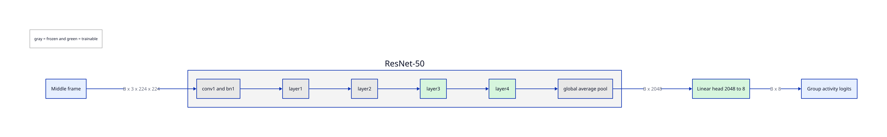
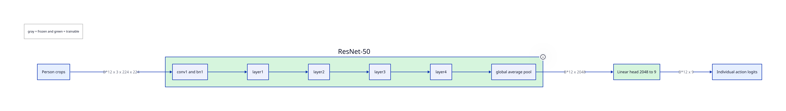
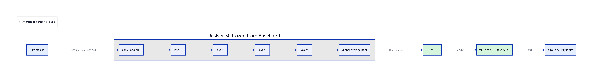
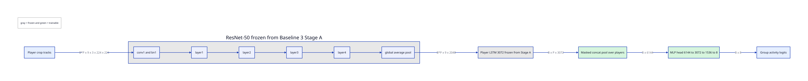
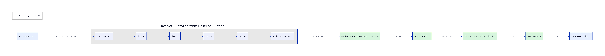
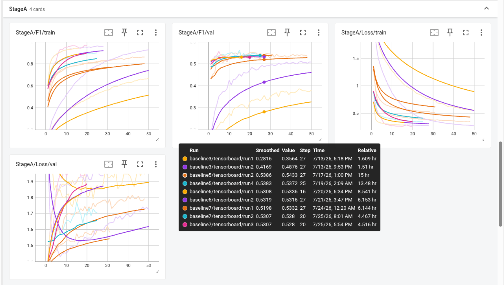
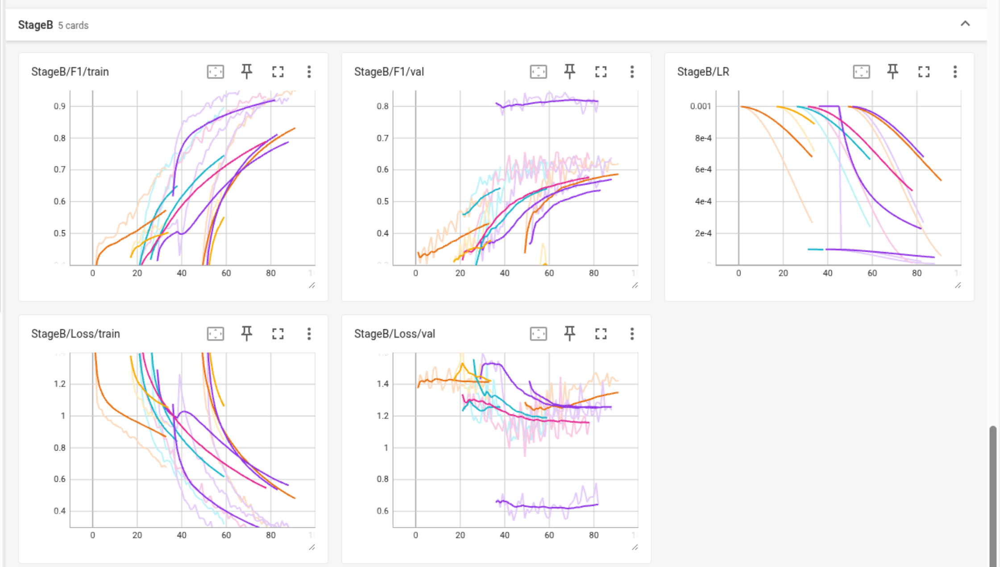
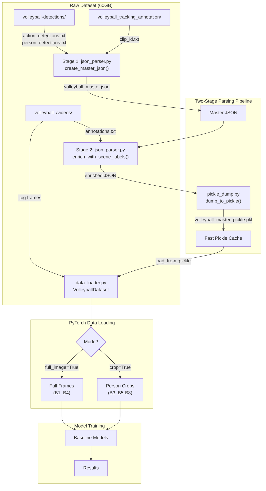

# Volleyball Group Activity Recognition

A deep learning pipeline for **group activity recognition** in volleyball videos, based on the [CVPR 2016 paper](https://www.cs.sfu.ca/~mori/research/papers/ibrahim-cvpr16.pdf) by Mostafa S. Ibrahim et al.



The snapshot shows the output of `uv run python -m src.data.visualize_data` with `video_fully_annotated=True`.

---

## At a Glance

- **Dataset**: 55 volleyball videos, 4,830 clips, two annotation levels — 8 group activities (scene-level) and 9 person actions (player-level).
- **Baselines**: 8 progressively complex models (B1–B8) sharing one data loader, training driver, and evaluator — **all eight complete with results.** B8 (the full hierarchical model + team-split pooling) is the best, and clears the CVPR-2016 paper's 81.9%.
- **Control experiment**: **B9** throws the whole hierarchy away — one YOLO26-x classifier on the raw frame, no player boxes, no LSTMs, no person labels. It lands within ~7 points of B8 while using *none* of the player annotations, which is the most interesting result in the project: see [B1–B8 vs. B9](#b1b8-vs-b9-what-the-hierarchy-buys).
- **Stack**: PyTorch + Hydra config + TensorBoard logging; **AdamW** optimizer; shared `Trainer` (one stage per call) and central batch unpackers; multi-GPU via `nn.DataParallel`; Kaggle dual-T4 ready.
- **Paper**: Ibrahim et al., *A Hierarchical Deep Temporal Model for Group Activity Recognition*, CVPR 2016 (+ journal extension, arXiv:1607.02643).
- **Full write-up**: [`reports/report.pdf`](reports/report.pdf) — the LaTeX report with per-baseline analysis and confusion-matrix figures.

### Results Summary

| Baseline | Idea | Test Acc | Macro F1 | Test Loss |
|----------|------|---------:|---------:|----------:|
| B1 | Single middle frame → fine-tuned ResNet-50 | 62.60% | 0.630 | 1.42 |
| B3 | Person crops → frozen backbone → concat-pool → MLP | 60.73% | 0.589 | 1.09 |
| B4 | 9 frames → frozen B1 backbone → LSTM | 66.12% | 0.673 | 1.05 |
| B5 | Per-player LSTM → pool summaries → MLP | 66.34% | 0.619 | 0.97 |
| B6 | Pool players per frame → scene LSTM + skip Conv1d | 70.53% | 0.686 | 1.04 |
| B7 | Hierarchical: player LSTM₁ → pool per frame → scene LSTM₂ (+ skips) | 73.75% | 0.701 | 0.89 |
| **B8** | **B7 + team-split pooling (per-team, concat)** | **85.64%** | **0.855** | **0.51** |
| B9 | *Control:* one YOLO26-x classifier on the raw frame — no boxes, no LSTM | 78.86%† | 0.802 | — |

**B8 leads by a wide margin** — team-split pooling adds **+11.9 accuracy / +0.154 macro-F1 over B7** and fixes the left/right confusion that limited every earlier model. Per-baseline architecture, hyperparameters, and analysis: [Baselines & Results](#baselines--results).

† B9 is scored **per frame** (13,370 test frames), the others **per clip** (1,337 test clips), and B9 reports no test loss (a standalone Ultralytics `val()` returns accuracy only). Its best run reached **83.17% / 0.846**; the 78.86% row is the run whose checkpoint and plots are on disk. See [Baseline 9](#baseline-9--one-model-no-player-annotations) for why the comparison is still worth making.

---

## Contents

- [Quick Start](#quick-start)
- [Baselines & Results](#baselines--results)
- [B1–B8 vs. B9 — What the Hierarchy Buys](#b1b8-vs-b9--what-the-hierarchy-buys)
- [TensorBoard](#tensorboard)
- [Dataset](#dataset)
- [Data Pipeline](#data-pipeline)
- [Data Loader API](#data-loader-api)
- [Project Structure](#project-structure)
- [References](#references)

---

## Quick Start

### 1. Install Dependencies

The project uses [`uv`](https://docs.astral.sh/uv/). Sync the environment from the lockfile:

```bash
uv sync
```

`uv run` (used throughout below) executes inside that environment automatically.

### 2. Prepare the Dataset (one-time)

```bash
# Step 1: build master JSON from detections + tracking and enrich with scene labels
uv run python -m src.json_parser

# Step 2: dump annotations to a pickle cache for fast metadata loading
uv run python -m src.pickle_dump

# Step 3: pack raw .jpg frames into a memory-mapped LMDB database
uv run python -m src.load_frames_into_lmdb
```

All three scripts are singletons — they skip work if the output already exists.

### 3. Verify the Loader

```bash
uv run python -m src.data.data_loader          # LMDB backend (local)
uv run python -m src.data.kaggle_data_loader   # disk backend (Kaggle / no LMDB)
```

Smoke-tests the dataset by pulling a few batches in full-image and crop mode. After (re)building the JSON/pickle, also verify that each clip's `scene_class` matches its own video's `annotations.txt` before training.

### 4. Train a Baseline

```bash
uv run python -m models.baseline1   # B1: Two-stage fine-tuned ResNet-50
uv run python -m models.baseline3   # B3: Person-then-group crop classifier
uv run python -m models.baseline4   # B4: Frozen B1 backbone → LSTM (needs baseline1_run2.pt)
uv run python -m models.baseline5   # B5: Per-player LSTM → pooled group head (needs baseline3_stage_a_run2.pt)
uv run python -m models.baseline6   # B6: Pooled-scene LSTM + skip Conv1d (needs baseline3_stage_a_run2.pt)
uv run python -m models.baseline7   # B7: Hierarchical LSTM₁→pool→LSTM₂ + skips (needs baseline3_stage_a_run2.pt)
uv run python -m models.baseline8   # B8: B7 + team-split pooling (needs baseline3_stage_a_run2.pt)
```

B9 is not Hydra-driven and does not use `VolleyballDataset` — Ultralytics classification wants an ImageFolder tree, so it gets exported first, and the model scale / batch size are **measured** rather than guessed:

```bash
uv run python -m utils.yolo_export                                     # frames → <DataSet>/yolo_cls/{train,val,test}/<class>/
uv run python -m utils.yolo_probe --task classify --imgsz 224 --nc 8   # largest scale + batch this GPU can train
uv run python models/baseline9.py                                      # train (reads the probe report if MODEL/BATCH are blank)
```

Hyperparameters live in `configs/baseline{1,3,4,5,6,7,8}.yaml` (Hydra). All baselines share `utils/trainer.py` (a `Trainer` that runs one stage per `run_stage` call — staged baselines call it 2–3 times) and the central batch unpackers in `src/data/unpackers.py`; optimizers are **AdamW**. Per-epoch metrics are written to `logs/<baseline>/runN.json` and a TensorBoard event file under `logs/<baseline>/tensorboard/runN/`.

### 5. Evaluate a Trained Checkpoint

```bash
uv run python -m utils.evaluate --model baseline1_run1.pt           --baseline baseline1
uv run python -m utils.evaluate --model baseline3_stage_b_run2.pt   --baseline baseline3
uv run python -m utils.evaluate --model baseline4_run2.pt           --baseline baseline4
uv run python -m utils.evaluate --model baseline5_stage_b_run4.pt   --baseline baseline5 --batch-size 4
uv run python -m utils.evaluate --model baseline6_stage_b_run2.pt   --baseline baseline6 --batch-size 4
uv run python -m utils.evaluate --model baseline7_stage_b_run3.pt   --baseline baseline7 --batch-size 4
uv run python -m utils.evaluate --model baseline8_stage_b_run1.pt   --baseline baseline8 --batch-size 4
uv run python -m utils.evaluate --model best.pt                     --baseline baseline9
```

The `baseline9` target takes a different route through `utils/evaluate.py` — it has no Hydra config, its checkpoint is an Ultralytics classifier, and its data is the exported ImageFolder — but it produces the **same four plots in the same class order**, so B9's confusion matrix is directly comparable to B1–B8's. A bare filename (`best.pt`) is resolved under B9's run directory; pass a full path to plot a different run.

Produces confusion matrix, classification report, precision–recall curves, and mAP under `plots/<baseline>/`. `--device cpu` forces CPU; `--batch-size` overrides the config's batch (B5/B6 clips are 9×~12 crops each, so batch 4 is the 8 GB-GPU sweet spot). The evaluator **auto-detects saved architecture details** (pool mode, LSTM shape, head width, frame count) from the checkpoint's tensor shapes, so legacy checkpoints and post-training YAML edits both load without changes.

---

## Baselines & Results

The ladder is a designed ablation — each rung isolates one component (person crops, player-level time, scene-level time, team structure):

| Baseline | Status | Input | Temporal | Player-Level | Scene-Level |
|----------|--------|-------|----------|--------------|-------------|
| **B1** | ✅ Done | Middle frame (full) | ✗ | ✗ | Image classifier (8 classes) |
| **B3** | ✅ Done | Middle frame (crops) | ✗ | Crop classifier (9 classes) | Max+mean concat pool over players → MLP (8 classes) |
| **B4** | ✅ Done | 9 frames (full) | LSTM on frame features | ✗ | LSTM → 8 classes |
| **B5** | ✅ Done | 9 frames (crops) | LSTM per player | Max+mean concat pool over players | MLP (8 classes) |
| **B6** | ✅ Done | 9 frames (crops) | LSTM on pooled frames + skip Conv1d fusion | Max-pool per frame (frozen B3 features) | Conv1d summary → MLP (8 classes) |
| **B7** | ✅ Done | 9 frames (crops) | LSTM₁ per player (+ feature-axis skip) + LSTM₂ (+ time-axis skip/Conv1d) | Pool per frame | LSTM₂ → 8 classes |
| **B8** | ✅ Done | 9 frames (crops) | Same as B7 | **Team-split** pool per frame (per-team, concat) | LSTM₂ → 8 classes |

Each baseline below follows the same template: **architecture → test metrics → analysis**, with hyperparameters and evaluation plots collapsed.

**Two-stage training** (B3, B5, B6, B7, B8). **Stage A** pretrains the model on the **9 person-action** labels — representation learning that teaches the backbone/LSTM what players are doing. **Stage B** freezes (or, from B6 on, first freezes then fine-tunes) that model and trains a group head on the **8 scene classes**; the person labels are a means, the scene classifier is the goal.

### Baseline 1 — Single-Frame Image Classifier

**Single frame, no persons, no time** — the floor of the ladder. Fine-tunes a **ResNet-50** on the middle frame of each clip to predict the 8 group activities. Training uses **two phases**: a linear probe (head-only) followed by **partial fine-tuning** (layer3/4 + head) with differential learning rates and cosine annealing.

<details>
<summary><b>Architecture</b> (D2 diagram — click to enlarge)</summary>



</details>

<details>
<summary><b>Hyperparameters</b> (<code>configs/baseline1.yaml</code>)</summary>

| Hyperparameter | Value |
|---|---|
| Backbone | ResNet-50 (pretrained) |
| Stage 1 (linear probe) | 10 epochs, lr = 1e-3 |
| Stage 2 (partial fine-tune: layer3/4 + head) | up to 100 epochs, backbone lr = 2.5e-4, head lr = 7.5e-4 |
| Batch Size | 16 (matched to B3 for comparability; LR linearly rescaled) |
| LR Scheduler | CosineAnnealingLR (T_max = 100, eta_min = 1e-5) |
| Label Smoothing | 0.01 |
| Weight Decay | 1e-4 |
| Early Stopping Patience | 25 epochs |

</details>

#### Test Metrics

| Metric | Value |
|--------|-------|
| Accuracy | **62.60%** |
| Macro F1 | **0.630** |
| Loss | 1.42 |

A single frame with no person or temporal structure sets the floor for the ladder.

<details>
<summary><b>Evaluation plots</b></summary>

| Confusion Matrix | Classification Report |
|:---:|:---:|
|  |  |
| **Precision-Recall Curves** | **mAP & F1 per Class** |
|  |  |

</details>

### Baseline 3 — Person Crops → Frozen Backbone → Concat-Pool → MLP

**First use of person crops — but no time.** A two-stage architecture. **Stage A** trains a **ResNet-50** end-to-end on individual **player crops** to classify the 9 person actions (`blocking`, `digging`, …, `waiting`). **Stage B** **freezes that backbone** (`fc = Identity`), pushes a clip's per-player crops through it to a `(P, 2048)` feature matrix, applies **concat max+mean pooling** across players → `(2 × 2048)`, and trains a small **MLP head** for the 8 group activities.

The concat pool gives the head two complementary signals: max captures *"is any player exhibiting feature k strongly?"* and mean captures *"what's the typical team level of feature k?"*. Class-weighted CrossEntropy is used in both stages to counter the heavy `standing` skew in Stage A (~70% of all crops) and the rare `l/r_winpoint` classes (~2.5× rarer than `spike/pass/set`) in Stage B.

<details>
<summary><b>Architecture</b> (D2 diagram — click to enlarge)</summary>



</details>

<details>
<summary><b>Hyperparameters</b> (<code>configs/baseline3.yaml</code>)</summary>

| Hyperparameter | Value |
|---|---|
| Backbone | ResNet-50 (pretrained) — `cfg.model.name` switchable to `resnet101` |
| Stage A (person-action) | up to 50 epochs, lr = 1e-3, full backbone, class-weighted CE |
| Stage B (group-activity head) | up to 50 epochs, lr = 1e-3, frozen backbone, MLP head |
| Stage B pool | `concat` (max + mean), classifier in = 2 × 2048 |
| MLP head | `Linear(4096, 512) → ReLU → Dropout(0.4) → Linear(512, 8)` |
| Optimizer | SGD, momentum 0.9, Nesterov, weight decay 5e-4 |
| LR Scheduler (Stage B) | CosineAnnealingLR |
| Label Smoothing | 0.01 |
| Batch Size | 16 clips (~12 player crops each) |
| Transforms | `crop_transforms.yaml` — direct 224×224 warp, whole player visible |
| Class-weighted loss | inverse-frequency (`w_k = N / (K · n_k)`), both stages |
| Multi-GPU | `nn.DataParallel` when `n_gpus > 1` (Kaggle dual-T4 ready) |
| Early Stopping Patience | 10 epochs per stage |

</details>

#### Test Metrics

| Metric | Value |
|--------|-------|
| Accuracy | **60.73%** |
| Macro F1 | **0.589** |
| Loss | 1.09 |

Stage A reaches 70.4% best validation accuracy (macro F1 0.512) on the 9 person actions; Stage B reaches 60.0% (0.584) on the 8 group activities.

**Known limitation:** the model overfits — final train accuracy is ~95% in both stages against ~58–70% validation. To be addressed with stronger augmentation / dropout / earlier stopping.

<details>
<summary><b>Evaluation plots</b></summary>

| Confusion Matrix | Classification Report |
|:---:|:---:|
|  |  |
| **Precision-Recall Curves** | **mAP & F1 per Class** |
|  |  |

</details>

### Baseline 4 — Temporal Image Classifier (Frozen B1 Backbone → LSTM)

**First use of time — but no persons.** Each clip's **9-frame window** goes through a **frozen** feature extractor (Baseline 1's fine-tuned backbone), giving a `(9, 2048)` sequence. A single-layer **LSTM** consumes it and its final hidden state is classified into the 8 group activities by an MLP head. Only the **LSTM + head train** (~5.4M params) — the backbone is frozen.

<details>
<summary><b>Architecture</b> (D2 diagram — click to enlarge)</summary>



</details>

<details>
<summary><b>Hyperparameters</b> (<code>configs/baseline4.yaml</code>)</summary>

| Hyperparameter | Value |
|---|---|
| Feature extractor | ResNet-50, frozen, loaded from `baseline1_run2.pt` |
| Input | 9 full frames per clip, 224×224 warp (`default_transforms.yaml`) |
| LSTM | hidden 512, 1 layer |
| MLP head | `Linear(512, 256) → ReLU → Dropout(0.3) → Linear(256, 8)` |
| Optimizer | SGD lr = 1e-3, momentum 0.9, Nesterov, weight decay 5e-4 |
| LR Scheduler | CosineAnnealingLR |
| Batch Size | 16 clips (144 frames/step through the frozen backbone) |
| Class-weighted loss | inverse-frequency, label smoothing 0.01 |
| Early Stopping | patience 10 (stopped at epoch 14; best epoch 4) |

</details>

#### Test Metrics

| Metric | Value |
|--------|-------|
| Accuracy | **66.12%** |
| Macro F1 | **0.673** |
| Loss | 1.05 |

Adding temporal context over B1's own features is worth **+3.5 accuracy points / +0.043 macro-F1** versus B1's single-frame result — the first direct evidence in this project that motion carries group-activity signal.

**Known limitation:** convergence is extremely fast (best validation F1 at epoch 4, train accuracy ~99% by epoch 14) — the same overfitting pattern as B1/B3, and the strongest argument yet for a shared regularization pass.

<details>
<summary><b>Evaluation plots</b></summary>

| Confusion Matrix | Classification Report |
|:---:|:---:|
|  |  |
| **Precision-Recall Curves** | **mAP & F1 per Class** |
|  |  |

</details>

### Baseline 5 — Temporal Person-Level Model (Per-Player LSTM → Pool → MLP)

**Persons AND time, at the player level.** A two-stage temporal extension of B3. **Stage A** feeds each player's 9-crop sequence through B3's **frozen** backbone and trains a **per-player LSTM** + head on the 9 person actions. **Stage B** freezes the Stage-A model, takes **one LSTM summary per player**, **pools across players** (masked concat, max ‖ mean), and trains an MLP for the 8 group activities. The pooling is **side-blind** — the root of the left/right winpoint confusion that surfaces here and persists through B7. Padded players are excluded from loss and pooling via the collate mask.

<details>
<summary><b>Architecture</b> (D2 diagram — click to enlarge)</summary>



</details>

<details>
<summary><b>Hyperparameters</b> (<code>configs/baseline5.yaml</code>)</summary>

| Hyperparameter | Value |
|---|---|
| Feature extractor | ResNet-50, frozen, loaded from `baseline3_stage_a_run2.pt` |
| Input | 9-frame crop window per player (`crop_transforms.yaml`, 224×224 warp) |
| Shared player LSTM | hidden 3072, 1 layer |
| Stage B pool | `concat` (max ‖ mean) → classifier in = 2 × 3072 |
| MLP head | `Linear(6144, 3072) → LayerNorm → ReLU → Dropout(0.2) → Linear(3072, 1536) → LayerNorm → ReLU → Dropout(0.2) → Linear(1536, 8)` |
| Optimizer | SGD lr = 1e-3, momentum 0.9, Nesterov, weight decay 5e-4 |
| LR Scheduler (Stage B) | CosineAnnealingLR |
| Batch | effective 8 = micro 4 × 2 gradient-accumulation steps |
| Class-weighted loss | inverse-frequency, both stages; label smoothing 0.01 |
| Early Stopping | patience 10 (Stage A: 25 epochs, best 15; Stage B: 34 epochs) |

</details>

#### Test Metrics (run 4)

| Metric | Value |
|--------|-------|
| Accuracy | **66.34%** |
| Macro F1 | **0.619** |
| Loss | 0.97 |

**Analysis.** B5 posts the best test accuracy of baselines B1–B5 (66.3% vs B4's 66.1%, B1's 62.6%, B3's 60.7%) and the best test loss of the project (0.97), and it dominates on the core activities: spike F1 reaches **0.78–0.80** and set **0.71** on both sides — per-player temporal modeling clearly pays off over B3's single-frame crops and B4's scene-level features. Cross-activity confusion is nearly eliminated (a spike is almost never called a pass or set).

The macro-F1 (0.619) nevertheless trails B4 (0.673), and the cause is a single failure mode: **`l_winpoint` / `r_winpoint` confusion — the worst left/right confusion of any baseline in this project**. `r_winpoint` collapses to 0.08 recall / 0.13 F1, with **83% of true `r_winpoint` clips predicted as `l_winpoint`** (and a further 13% of `l_winpoint` leaking the other way). The explanation is structural: max/mean pooling across all ~12 players is orderless and position-blind, so the pooled vector carries no signal about *which side of the net* the players are on. Pass/spike/set survive because the acting players' poses differ, but winpoint clips show both teams in near-identical celebration/standing poses — side identity is the *only* discriminative signal, and the pooling erases it. This is precisely the failure B8's team-split pooling (pool each team's 6 players separately, concatenate) is designed to fix.

<details>
<summary><b>Evaluation plots</b></summary>

| Confusion Matrix | Classification Report |
|:---:|:---:|
|  |  |
| **Precision-Recall Curves** | **mAP & F1 per Class** |
|  |  |

</details>

### Baseline 6 — Scene-Level Temporal Model (Pool per Frame → LSTM → Skip Conv1d Fusion)

**Time at the scene level, plus the first skip connection.** B6 moves the temporal model from the player level (B5) to the **scene level**: each frame's crops go through B3's **frozen** backbone and are **max-pooled across players per frame** → a `(9, 2048)` scene sequence. A **scene-level LSTM** consumes it, and — instead of only the last hidden state — all 9 hidden states are concatenated **along time with a projection of the pooled features (skip connection)** → `(18, 512)`, which a **global-kernel Conv1d** collapses into a 128-dim clip summary.

**Stage A** pretrains the LSTM + projection + Conv1d on the 9 person actions using single-player tracks (P=1, so the per-frame pooling is an identity). **Stage B** is two-phase, mirroring B1: a **linear probe** (temporal model frozen, MLP head only), then a **joint fine-tune** that unfreezes the LSTM/projection/Conv1d with differential learning rates. The ResNet extractor stays frozen throughout.

<details>
<summary><b>Architecture</b> (D2 diagram — click to enlarge)</summary>



</details>

<details>
<summary><b>Hyperparameters</b> (<code>configs/baseline6.yaml</code>)</summary>

| Hyperparameter | Value |
|---|---|
| Feature extractor | ResNet-50, frozen, loaded from `baseline3_stage_a_run2.pt` |
| Input | 9-frame crop window per player (`crop_transforms.yaml`, 224×224 warp) |
| Player pool (per frame, pre-LSTM) | masked **max** over players → `(9, 2048)` scene sequence |
| Scene LSTM | hidden 512, 1 layer |
| Skip connection | pooled features → `Linear(2048, 512)`, concat with LSTM outputs along time → `(18, 512)` |
| Temporal fusion | `Conv1d(512→256, k=18) → BN → ReLU → Conv1d(256→128, k=1) → BN` → 128-dim summary |
| MLP head | `Linear(128, 512) → LayerNorm → ReLU → Dropout(0.2) → Linear(512, 256) → LayerNorm → ReLU → Dropout(0.2) → Linear(256, 8)` |
| Stage A | 9-action pretrain on P=1 tracks; SGD lr = 1e-3; 28 epochs (early stop, best at 13; val action F1 0.539) |
| Stage B phase 1 | linear probe, head only, lr = 1e-3 flat, 10 epochs |
| Stage B phase 2 | joint fine-tune: temporal lr = 1e-4, head lr = 1e-3 (×10), CosineAnnealingLR, 50 epochs |
| Batch | effective 8 = micro 4 × 2 gradient-accumulation steps |
| Class-weighted loss | inverse-frequency, both stages; label smoothing 0.01 |

</details>

#### Test Metrics (run 2)

| Metric | Value |
|--------|-------|
| Accuracy | **70.53%** |
| Macro F1 | **0.686** |
| Loss | 1.04 |

**Analysis.** B6 is the **first baseline to lead on both metrics**: accuracy jumps **+4.2 points over B5** (70.5% vs 66.3%) and macro-F1 edges past B4's long-standing best (0.686 vs 0.673). Scene-level temporal modeling over pooled person features — the paper's "two-stage model without LSTM 1", which scores 74.7% there — clearly beats both scene-level features without persons (B4) and per-player summaries without scene dynamics (B5), and the remaining ~4-point gap to the paper's number is consistent with our frozen (rather than end-to-end) backbone.

The two-phase Stage B was decisive, and the phase curves prove why: the **linear probe plateaued at 0.426 val F1** — a frozen LSTM pretrained only on person actions is a poor group-activity descriptor (the same lesson as the discarded run 1, which froze everything and stalled at 0.33) — while **joint fine-tuning lifted val F1 to 0.646 (+0.22)**. The scene LSTM has to see the group labels; the probe merely gives the head a stable starting point before the temporal weights move.

Per-class, B6 is strong on the acting-player activities — spike F1 hits **0.86/0.82** (l/r) and set 0.72/0.69 — and it **halves B5's winpoint collapse without any team-aware pooling**: `r_winpoint` recall recovers from 0.08 to **0.47** (F1 0.13 → 0.49) and `l_winpoint` reaches F1 0.55. Scene-level temporal context evidently carries some side signal that per-player last-hidden summaries lost. Still, **left/right confusion is now the dominant remaining error across the board**: 47% of true `r_winpoint` goes to `l_winpoint`, l/r-pass leak 20–22% into each other, and 21% of `l_set` is called `r_set` — the model is often right about *what* happened but guesses *which side*. All-player max pooling remains side-blind; that is exactly B8's team-split target. Overfitting is the other standing issue (Stage A train F1 0.96 vs val 0.54; fine-tune train 0.93 vs val 0.64).

<details>
<summary><b>Evaluation plots</b></summary>

| Confusion Matrix | Classification Report |
|:---:|:---:|
|  |  |
| **Precision-Recall Curves** | **mAP & F1 per Class** |
|  |  |

</details>

### Baseline 7 — Full Hierarchical Model (Player LSTM₁ → Pool per Frame → Scene LSTM₂, with skips)

**The full hierarchy — two LSTMs and two skips; the strongest model without team structure (only B8 beats it).** B7 is the paper's two-stage hierarchical model: a **player-level LSTM₁** runs over each player's 9-frame track, players are pooled per frame into a scene sequence, and a **scene-level LSTM₂** models the clip. On top of the paper it keeps **two skip connections**: (1) **player-level, feature-axis** — each timestep's per-player vector is `[LSTM₁ output ‖ projected backbone features]` (the paper's fc7‖hidden trick), so appearance rides alongside the temporal summary while the time axis survives for LSTM₂; (2) **scene-level, time-axis** — B6's recipe of concatenating LSTM₂'s hidden states with a projection of the pooled scene features along time, then a **global-kernel Conv1d** fusion.

**Stage A** pretrains LSTM₁ + projection on the 9 person actions (P=1 tracks). **Stage B** is two-phase (mirroring B6): a probe with the player model frozen, then a joint fine-tune that unfreezes LSTM₁ + projection at a lower LR. Both stages select the best checkpoint on validation **accuracy**.

<details>
<summary><b>Architecture</b> (D2 diagram — click to enlarge)</summary>


</details>

<details>
<summary><b>Hyperparameters</b> (<code>configs/baseline7.yaml</code>)</summary>

| Hyperparameter | Value |
|---|---|
| Feature extractor | ResNet-50, frozen, loaded from `baseline3_stage_a_run2.pt` |
| Player LSTM₁ | hidden 512, 1 layer; per-player repr = LSTM ‖ proj = **1024** |
| Scene LSTM₂ | hidden 512; input = pooled scene seq (2048 for concat pool) |
| Scene fusion | `Conv1d(512→256, k=18) → BN → ReLU → Conv1d(256→128, k=1) → BN` → 128-dim summary |
| MLP head | `Linear(128, 512) → LN → ReLU → Drop(0.2) → Linear(512, 256) → LN → ReLU → Drop(0.2) → Linear(256, 8)` |
| Optimizer | **AdamW** (Stage A 1e-3; Stage-B probe 1e-3; fine-tune player 1e-4 / scene 1e-3) |
| Stage B | 10-epoch probe → 50-epoch joint fine-tune, CosineAnnealingLR |
| Batch | effective 8 = micro 4 × 2 gradient-accumulation steps |

</details>

#### Test Metrics (run 3)

| Metric | Value |
|--------|-------|
| Accuracy | **73.75%** |
| Macro F1 | **0.701** |
| Loss | **0.89** |

**Analysis.** B7 is the **best model without team-split pooling** (only B8 beats it) — accuracy **+3.2 points over B6** (73.8% vs 70.5%), macro-F1 **+0.015** (0.701 vs 0.686), and a lower test loss (0.89). The full hierarchy pays off: a player-level LSTM that adapts, feeding a scene-level LSTM, beats B6's single scene-level LSTM over pooled frames.

The result hinges entirely on the **two-phase Stage B**, and the phase curves show why. With the player LSTM₁ frozen, the probe plateaus at ~0.51 validation accuracy; unfreezing LSTM₁ for the joint fine-tune lifts validation accuracy to ~0.68 (**+0.17**). That's the same lesson as B6 — the pretrained temporal weights must be allowed to adapt to the group task — and it's why B7's earlier *frozen* single-phase run scored only 65.8%, below B6. Unfreezing turned that into +7.9 points, and B7 held the top spot until team-split pooling (B8) surpassed it.

What B7 still does **not** fix is the left/right confusion: it pools all players side-blind, so winpoint/pass/set still leak across sides (see the confusion matrix). That is exactly what B8's team-split pooling targets.

<details>
<summary><b>Evaluation plots</b> (run 3)</summary>

| Confusion Matrix | Classification Report |
|:---:|:---:|
|  |  |
| **Precision-Recall Curves** | **mAP & F1 per Class** |
|  |  |

</details>

### Baseline 8 — Team-Split Pooling (B7 + group-style pooling)

**B7 + team structure — the one thing every prior model ignores.** B8 is B7 with **one architectural change**: instead of pooling all ~12 players into a single scene vector (side-blind), **each team's players are pooled separately and the two team vectors concatenated**. This preserves *which side did what* — the signal every earlier baseline erases, and the direct fix for the dominant **left/right confusion** (winpoint, pass, set). **Both of B7's skip connections are kept unchanged**; only the scene vector doubles in width (LSTM₂ input → 4·H1 for max/mean, 8·H1 for concat).

Team membership comes from the data loader in **team mode** (`with_teams=True`): the collate emits a per-player `team_ids` tensor (0 = left court side, 1 = right, −1 for padding), derived once per clip from box center-x ordering — the paper's method, applied as a fixed per-track label so it coexists with the track-consistency the LSTMs require. Uneven or zero-player teams are handled by masking (a missing team pools to a zero vector, no NaN).

<details>
<summary><b>Architecture</b> (D2 diagram — click to enlarge)</summary>


</details>

<details>
<summary><b>Hyperparameters</b> (<code>configs/baseline8.yaml</code>)</summary>

Identical to B7, except the per-frame pooling is **per-team** and the scene vector doubles:

| Hyperparameter | Value |
|---|---|
| Everything | as B7 (`configs/baseline8.yaml`) |
| Loader | `with_teams=True` → emits `team_ids` per player |
| Per-team pool | max / mean / **concat** → team_width = 2·H1 or 4·H1 |
| Scene vector | concat of the two teams → LSTM₂ input = 4·H1 (max/mean) or **8·H1** (concat) |

</details>

#### Test Metrics (run 1)

| Metric | Value |
|--------|-------|
| Accuracy | **85.64%** |
| Macro F1 | **0.855** |
| Loss | **0.51** |

**Analysis.** B8 is by far the **best model in the project** — **+11.9 accuracy / +0.154 macro-F1 over B7** (85.6% vs 73.8%), and it clears the CVPR-2016 paper's full model (81.9%). The single change from B7 — pooling each team separately instead of all players together — is responsible, and its effect is visible exactly where predicted.

The confusion matrix shows the **left/right confusion is fixed**. `r_winpoint`, which collapsed to ~0.08 recall in B5 and ~0.38 in B7 (47% of it predicted as `l_winpoint`), now sits at **0.86** with only 5% cross-side leak; `l_winpoint` reaches **0.83**. The l/r-pass swap (20–24% each way in B6/B7) is gone — both at **0.86–0.87**. Spike is near-perfect (**0.93 / 0.90**). What remains is *within-side* confusion (e.g. `l_set` → `l_spike` 12%), not left/right — the model now reliably knows which team acted.

The two-phase Stage B again mattered, but note how strong team pooling is on its own: the **probe alone** (player LSTM₁ frozen) reached **0.826 val accuracy** — already above B7's fully-fine-tuned 0.68 — and the joint fine-tune lifted it to 0.84.

> [!note]
> **Ablation caveat:** B8 used the `baseline3_stage_a_run3` backbone while B7 used `run2` (a slightly weaker one, person-action val acc 70.4% vs 75.0%). So the +11.9 gain conflates team-split pooling with a better backbone. The pooling is clearly dominant — the paper's own team-pooling ablation is +11.6, and the probe-alone result isolates the effect — but a perfectly clean comparison would re-run B7 on `run3`.

<details>
<summary><b>Evaluation plots</b> (run 1)</summary>

| Confusion Matrix | Classification Report |
|:---:|:---:|
|  |  |
| **Precision-Recall Curves** | **mAP & F1 per Class** |
|  |  |

</details>

### Baseline 9 — One Model, No Player Annotations

**The control experiment.** Every baseline from B3 onward is built on the paper's premise: group activity is a function of *what the individual players are doing*, so you need boxes, per-player tracks, person-action labels, and a hierarchy to pool them. B9 tests that premise by discarding all of it. One **YOLO26-x classifier** sees the whole 224×224 frame and predicts one of the 8 group activities directly. No detector head, no crops, no `team_ids`, no LSTM, no Stage A — and **not a single player annotation is read**. It is the "just throw a big pretrained model at it" answer, included precisely because it is the honest thing to compare the hierarchy against.

Two pieces of plumbing make it fit the project. `utils/yolo_export.py` rewrites the same annotations into the ImageFolder layout Ultralytics needs (`<root>/<split>/<class>/*.jpg`), honouring the project's video split so the test set is the same 16 videos — and **warps frames to a square** rather than symlinking them, because Ultralytics' `Resize(shortest edge) + CenterCrop` would throw away 44% of the court width, and with 8 classes that come in left/right pairs the court width *is* the label. `utils/yolo_probe.py` walks the scale ladder (x → l → m → s → n) to find the largest architecture the GPU can train, then ladders the batch size for it, and writes a report `models/baseline9.py` reads automatically.

<details>
<summary><b>Hyperparameters</b> (constants at the top of <code>models/baseline9.py</code> — B9 has no Hydra config)</summary>

| Hyperparameter | Value | Why |
|---|---|---|
| Model | `yolo26x-cls.pt` (pretrained) | Largest scale `utils.yolo_probe` fit on the card |
| Batch / imgsz | 64 / 224 | Probed; 224 matches the exporter's square warp so the center crop is a no-op |
| Epochs / patience | 100 / 25 | Ultralytics' own early stopping |
| Optimizer | `auto` (Ultralytics) → AdamW, lr0 0.01, wd 5e-4 | Left at the framework default |
| `fliplr` / `flipud` | **0.0** / 0.0 | A mirrored frame is a *different class* (`l_set` ↔ `r_set`) — the 0.5 default would relabel half the training set |
| `scale` | 0.2 | RandomResizedCrop keeps 80–100%; the 0.5 default can crop away the acting side of the court |
| `erasing` / erase scale | 0.2 / **(0.005, 0.02)** | Ultralytics exposes only the *probability*; torchvision's default box is up to **33% of the frame**, which erased the acting player outright. Capped at one player box (~2% of a 224² frame) by `make_erasing_shrinker()` |
| Logging | `Trainer.log_epoch` / `record_test` | Ultralytics owns the loop, but the scalars, JSON history and hparams card come out in B1–B8's format |

</details>

#### Test Metrics (run 3 — the checkpoint on disk)

| Metric | Value |
|--------|-------|
| Accuracy | **78.86%** |
| Macro F1 | **0.802** |
| Top-5 accuracy | 98.86% |
| Test loss | — (Ultralytics' standalone `val()` reports accuracy only) |

**Analysis — B9 fails in the opposite direction from B1–B7.** The whole B5→B8 storyline was *left/right confusion*: side-blind pooling made `r_winpoint` collapse to 0.08 recall in B5 and 0.38 in B7, and team-split pooling in B8 was the fix. B9 does not have that problem at all. Its **winpoints are its two best classes** (`l_winpoint` **0.90**, `r_winpoint` **0.86**, with only 6–8% cross-side leak), which makes sense: a winpoint is a whole-scene state — players scattered and celebrating — and a full-frame model reads scene layout naturally, without needing to know who did what.

What B9 gets wrong is the **fine-grained action distinction *within* a side**. The five biggest off-diagonal cells are all same-side action swaps: `r_set` → `r-pass` **0.23**, `l_set` → `l-pass` **0.17**, `r-pass` → `r_set` **0.16**, `r_spike` → `r_set` **0.11**, `l-pass` → `l_set` **0.11**. Set and pass differ by one player's arm posture — overhead fingertips vs. forearm platform — and in a 224×224 full frame that player is roughly **17×62 pixels**. The information is simply not resolvable at that scale. Spike, which has a distinctive whole-body silhouette (a jump at the net), survives fine (**0.87 / 0.82**).

That is exactly the trade the hierarchy makes explicit: **player crops buy resolution on the action; team-split pooling buys the side.** B9 gets the side for free from global scene layout and loses the action; B1–B7 got the action from crops and lost the side until B8 fixed it.

> [!warning]
> **B9 overfits hard.** By epoch 98 training loss is **0.0027** while validation loss has climbed to **1.93** from a minimum near 1.21 — the model memorized 21.5k frames long before it stopped improving. This is why the erasing augmentation matters here, and it is also the most likely reason run 1 (which ran Ultralytics' *default* erasing — 40% of frames, up to a third of the frame blanked) scored **83.17% / 0.846**, its best result, while later runs with the erasing dialled down landed at 78.9–79.7%. The heavy occlusion was acting as the regularizer. Run 1's weights were overwritten (`exist_ok=True` reuses the run directory), so its plots cannot be regenerated — the metrics above are run 3's, which is the checkpoint that still exists.

<details>
<summary><b>Evaluation plots</b> (run 3)</summary>

| Confusion Matrix | Classification Report |
|:---:|:---:|
|  |  |
| **Precision-Recall Curves** | **mAP & F1 per Class** |
|  |  |

</details>

---

### B1–B8 vs. B9 — What the Hierarchy Buys

| | B8 (full hierarchy) | B9 (one model) |
|---|---|---|
| Test accuracy | **85.64%** (clip-level) | 78.86% frame-level (best run 83.17%) |
| Macro F1 | **0.855** | 0.802 |
| Annotations used | boxes + tracks + 9 person actions + team sides | **scene label only** |
| Pipeline | detect → track → crop → backbone → LSTM₁ → team pool → LSTM₂ → head | resize → classifier |
| Training stages | 3 (Stage A, Stage B probe, Stage B fine-tune) + a pretrained B3 backbone | 1 |
| Best classes | winpoint 0.83/0.86, spike 0.93/0.90 | winpoint **0.90/0.86**, spike 0.87/0.82 |
| Worst failure | *(fixed in B8)* left/right side confusion | set ↔ pass **within** a side (0.17–0.23) |
| Code | ~500 lines + shared loader/trainer | ~330 lines, one `model.train()` call |

**The honest reading.** B8 wins — by 6.8 points on its best-run comparison, ~2.5 points if you compare B9's best run — and it wins on the metric that matters, macro F1 (0.855 vs 0.846 at best). But it needs the *entire* annotation stack to do it: every player box, every track, 9 person-action labels, and a court-side assignment, plus a three-stage training schedule and a pretrained person backbone. B9 needs a directory of JPEGs sorted into 8 folders.

So the hierarchy is worth roughly **+3 to +7 accuracy points** — real, reproducible, and consistent with the paper's own ablations — but it is not the difference between working and not working, and a project that has only scene labels is not stuck. The more useful conclusion is *where* the gap lives: B9's error budget is dominated by set↔pass confusion that a full-frame model at 224² physically cannot resolve, which says the player crops are earning their keep on **action resolution**, not on scene understanding. A B9 variant at higher `imgsz`, or a clip-level majority vote over its 10 frames per clip (B9 is currently scored on individual frames while every other baseline is scored per clip), would close part of the gap for free — and both are cheaper than the annotation pipeline.

---

## TensorBoard

Every run logs per-epoch loss, accuracy, and macro-F1 to TensorBoard under `logs/<baseline>/tensorboard/<run>/`, namespaced by stage (`StageA/…`, `StageB/…`). Launch with:

```bash
uv run tensorboard --logdir logs
```

B9 is the exception: `OUT_ROOT` in `models/baseline9.py` redirects its checkpoints **and** its logs to the internal SSD (`~/volleyball_out/`), because the repo's external drive returned I/O errors under the 227 MB-per-improving-epoch checkpoint traffic. Point TensorBoard at both, or set `OUT_ROOT = None` to write beside the repo like every other baseline:

```bash
uv run tensorboard --logdir_spec repo:logs,b9:~/volleyball_out/logs
```

The dashboards below overlay the runs across baselines, so the two-stage training is directly comparable — **Stage A** (person-action pretraining, 9 classes) and **Stage B** (group-activity, 8 classes):

**Stage A — person-action pretraining**



**Stage B — group-activity classification**



---

## Dataset

### Class Labels

**8 Group Activities (scene-level)**

| Index | Activity | Index | Activity |
|-------|----------|-------|----------|
| 0 | `l-pass` | 4 | `l_set` |
| 1 | `r-pass` | 5 | `r_set` |
| 2 | `l-spike` | 6 | `l_winpoint` |
| 3 | `r_spike` | 7 | `r_winpoint` |

**9 Person Actions (player-level)**

| Index | Action | Index | Action |
|-------|--------|-------|--------|
| 0 | `blocking` | 5 | `setting` |
| 1 | `digging` | 6 | `spiking` |
| 2 | `falling` | 7 | `standing` |
| 3 | `jumping` | 8 | `waiting` |
| 4 | `moving` | | |

### Splits

| Split | Videos | Clips |
|-------|--------|-------|
| **Train** | 24 | 2,152 |
| **Validation** | 15 | 1,341 |
| **Test** | 16 | 1,337 |
| **Total** | 55 | 4,830 |

Split definitions live in `configs/data_split.py`.

<details>
<summary><b>Raw directory layout</b></summary>

```
DataSet/
├── volleyball_/videos/                    # Raw video frames + annotations
│   ├── 0/                                 # Video 0
│   │   ├── annotations.txt                # Group activity + person boxes per clip
│   │   ├── 3596/                          # Clip (middle frame = 3596)
│   │   │   ├── 3576.jpg                   # 41 frames per clip
│   │   │   ├── 3577.jpg
│   │   │   ├── ...
│   │   │   └── 3616.jpg
│   │   └── 13286/
│   │       └── ...
│   ├── 1/
│   └── ... (55 videos total, ~4,830 clips)
│
├── volleyball-detections/                 # Pre-computed detections
│   └── {video_id}/{clip_id}/
│       ├── action_detections.txt          # Tab-separated: frame  N  [x y w h score label] × N
│       └── person_detections.txt          # Tab-separated: frame  N  [x y w h score label] × N
│
├── volleyball_tracking_annotation/        # Player tracking with IDs
│   └── {video_id}/{clip_id}/
│       └── {clip_id}.txt                  # Space-separated: id x1 y1 x2 y2 frame f1 f2 f3 action
│
├── volleyball_master.json                 # Stage 1+2 unified output
└── volleyball_master_pickle.pkl           # Fast-load cache
```

</details>

---

## Data Pipeline

The raw dataset contains three separate annotation sources. The pipeline unifies them in two parsing stages, then caches in two fast-loading formats. End-to-end flow:


```mermaid
graph TB
    subgraph "Raw Dataset (60GB)"
        A[volleyball-detections/] -->|action_detections.txt<br>person_detections.txt| P
        B[volleyball_tracking_annotation/] -->|clip_id.txt| P
        C[volleyball_/videos/] -->|annotations.txt| E
        C -->|.jpg frames| DL
    end

    subgraph "Two-Stage Parsing Pipeline"
        P["Stage 1: json_parser.py<br>create_master_json()"] -->|volleyball_master.json| D
        D[Master JSON] --> E["Stage 2: json_parser.py<br>enrich_with_scene_labels()"]
        E -->|enriched JSON| F["pickle_dump.py<br>dump_to_pickle()"]
        F -->|volleyball_master_pickle.pkl| G[Fast Pickle Cache]
    end

    subgraph "PyTorch Data Loading"
        G -->|load_from_pickle| DL["data_loader.py<br>VolleyballDataset"]
        DL --> H{Mode?}
        H -->|full_image=True| I["Full Frames<br>(B1, B4)"]
        H -->|crop=True| J["Person Crops<br>(B3, B5-B8)"]
    end

    subgraph "Model Training"
        I --> M[Baseline Models]
        J --> M
        M --> R[Results]
    end
```

- **Stage 1 — player-level** (`create_master_json()`): parses `action_detections.txt` / `person_detections.txt` (→ `{box, score, label}`) and `clip_id.txt` tracking (→ `{id, box, flags, action}`) into one master JSON entry per clip.
- **Stage 2 — scene-level** (`enrich_with_scene_labels()`): reads each video's `annotations.txt` for the group-activity label and attaches it as `scene_class`, keyed **per video** (frame names are unique only within a video).
- **Caching**: enriched JSON (~1.6 GB) → pickle (~247 MB) for fast metadata; raw `.jpg` frames (~50 GB) → memory-mapped LMDB for fast lazy image loads. Both build scripts are singletons.

---

## Data Loader API

`VolleyballDataset` is a **generic** PyTorch `Dataset` that loads from the pickle cache and supports all baselines through constructor flags. All logic lives in a shared base class (`src/data/base_dataset.py`); two thin backends provide the frame storage:

| Import from | Frame storage | Use when |
|---|---|---|
| `src.data.data_loader` | LMDB (memory-mapped) | local training, LMDB built |
| `src.data.kaggle_data_loader` | direct disk reads | Kaggle (no space for LMDB) |

Both expose the identical `VolleyballDataset` / `collate_fn` interface — switching is a one-line import change.

```python
from src.data.data_loader import VolleyballDataset, collate_fn

# B1: Full image, middle frame only → (image, group_label)
ds = VolleyballDataset(mode="train", n_frames=1, full_image=True, transform=transform)

# B3: Cropped persons, middle frame → (crops [P,C,H,W], person_labels [P], group_label)
ds = VolleyballDataset(mode="train", n_frames=1, crop=True, transform=transform)

# B4: Full image, 9-frame sequence → (images [9,C,H,W], group_label)
ds = VolleyballDataset(mode="train", n_frames=9, full_image=True, transform=transform)

# B5-B8: Cropped persons, 9-frame sequence → (crops [9,P,C,H,W], person_labels [P], group_label)
ds = VolleyballDataset(mode="train", n_frames=9, crop=True, transform=transform)
```

### Collate Function

`collate_fn` handles **variable player counts** across clips by padding the player dimension to the batch maximum and returning a boolean mask:

```python
loader = DataLoader(dataset, batch_size=8, collate_fn=collate_fn)
# Crop mode returns:               (crops, person_labels, group_labels, masks)
# Crop mode with with_teams=True:  (crops, person_labels, group_labels, masks, team_ids)
```

**Team mode** (`VolleyballDataset(..., with_teams=True)`) is opt-in and fully backward-compatible: the first four elements are unchanged, and a 5th `team_ids` tensor `(B, P)` is appended — `0` = left court side, `1` = right, `-1` for padded slots, aligned with the mask. Team membership is derived once per clip from box center-x ordering (the paper's split), so it coexists with the track-ID player ordering the temporal LSTMs require. B8 is the only consumer.

### Batch Unpackers

An *unpacker* turns a collated batch into `(model_inputs, target)` for the shared epoch driver (`model(*inputs)`). Unpacking happens **after** collate (it reshapes the batched, padded tensors), so it lives in `src/data/unpackers.py`, not the dataset. The canonical set, selectable by name via `get_unpacker(task)`:

| task | contract | used by |
|---|---|---|
| `person_frame` | single-frame crops → `((crops,), labels)` | B3 Stage A |
| `person_seq` | temporal → `((seqs,), labels)` | B5 Stage A |
| `person_track` | temporal → `((P=1 tracks, masks), labels)` | B6/B7/B8 Stage A |
| `group_crop` | `((crops, masks), group)` | B3/B5/B6/B7 Stage B |
| `group_team` | `((crops, masks, team_ids), group)` | B8 Stage B |

Adding a new baseline = one model class + pick the matching unpacker; no changes to the loader or the training loop.

---

## Project Structure

<details>
<summary><b>Directory tree</b></summary>

```
Project1/
├── configs/
│   ├── __init__.py              # Package exports
│   ├── path_config.py           # All dataset/output paths (local + Kaggle aware)
│   ├── data_split.py            # Train/val/test video IDs
│   ├── labels.py                # Label-to-index mappings (8 group + 9 person)
│   ├── baseline1.yaml           # Hydra config for B1
│   ├── baseline3.yaml           # Hydra config for B3
│   ├── baseline4.yaml           # Hydra config for B4
│   ├── baseline5.yaml           # Hydra config for B5
│   ├── baseline6.yaml           # Hydra config for B6
│   ├── baseline7.yaml           # Hydra config for B7
│   ├── baseline8.yaml           # Hydra config for B8
│   └── transforms/
│       ├── default_transforms.yaml  # FULL-FRAME baselines (B1, B4): 224×224 warp
│       └── crop_transforms.yaml     # CROP baselines (B3, B5–B8): 224×224 warp
│
├── src/
│   ├── json_parser.py           # Two-stage parsing pipeline
│   ├── pickle_dump.py           # Singleton pickle dump/load
│   ├── load_frames_into_lmdb.py # Pack frames into LMDB
│   ├── load_frames_into_pickle.py
│   └── data/
│       ├── base_dataset.py      # Shared dataset logic + collate_fn (+ with_teams / team_ids)
│       ├── data_loader.py       # LMDB backend
│       ├── kaggle_data_loader.py# Direct-from-disk backend (Kaggle)
│       ├── unpackers.py         # Central batch unpackers (person/group/team) + factory
│       ├── data_summary.py      # Statistics and class distributions
│       └── visualize_data.py    # Dataset visualization
│
├── models/
│   ├── baseline1.py             # B1: Two-stage fine-tuned ResNet50 (✅ done)
│   ├── baseline3.py             # B3: Person-then-group crop classifier (✅ done)
│   ├── baseline4.py             # B4: Frozen backbone → LSTM temporal classifier (✅ done)
│   ├── baseline5.py             # B5: Per-player LSTM → pooled group head (✅ done)
│   ├── baseline6.py             # B6: Pooled-scene LSTM + skip Conv1d (✅ done)
│   ├── baseline7.py             # B7: hierarchical two-LSTM + skips (✅ done — 73.8%)
│   ├── baseline8.py             # B8: B7 + team-split pooling (✅ done — best, 85.6%)
│   └── baseline9.py             # B9: single YOLO classifier, no annotations (✅ done — 78.9%)
│
├── utils/
│   ├── utility.py               # Epoch driver + class-weight tools + checkpoint I/O
│   ├── trainer.py               # Shared Trainer: one stage per run_stage(); log_epoch/record_test are the log sink B9 reuses
│   ├── featureExtractor.py      # Frozen CNN feature extractor (ImageNet or B1 checkpoint)
│   ├── evaluate.py              # Post-training evaluation + plots (all baselines, incl. B9's YOLO path)
│   ├── plotting.py              # Confusion matrix, PR curves, mAP
│   ├── yolo_export.py           # B9: frames → Ultralytics ImageFolder tree (square-warped)
│   ├── yolo_probe.py            # B9: largest model scale + batch this GPU can train
│   ├── download_models.py       # Pull trained checkpoints from Google Drive
│   └── load_model_config.py     # Hydra config → transforms/scheduler builders
│
├── reports/
│   ├── report.tex               # LaTeX report
│   └── figures/                 # Report figures (incl. demo thumbnail)
│
├── DataSet/                     # Raw data (not tracked in git)
├── saved_models/                # Model checkpoints (.pt)
├── runs/                        # Hydra run outputs
├── logs/                        # Per-baseline TensorBoard + JSON metric logs
├── reports/report.pdf           # Full LaTeX write-up
└── plots/                       # Evaluation + architecture visualizations
    ├── architecture/            # D2 source (.d2) + rendered per-baseline diagrams
    └── baseline{1,3,4,5,6,7,8}/ # Four eval plots per baseline: Confusion Matrix,
                                 # Classification Report, PR Curves, mAP & F1
```

</details>

---

## References

- **Project report**: [`reports/report.pdf`](reports/report.pdf) — full write-up with per-baseline analysis and figures.
- Ibrahim, M. S., Muralidharan, S., Deng, Z., Vahdat, A., & Mori, G. (2016). *A Hierarchical Deep Temporal Model for Group Activity Recognition*. **CVPR 2016**. [PDF](https://www.cs.sfu.ca/~mori/research/papers/ibrahim-cvpr16.pdf).
- Journal extension with group-style (team-split) pooling: [arXiv:1607.02643](https://arxiv.org/abs/1607.02643) — source of the B1–B8 baseline ablation and the accuracy numbers cited above.
